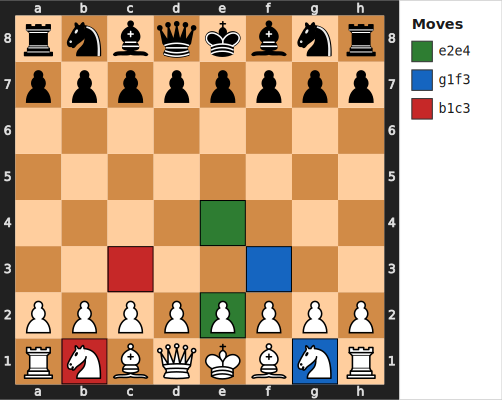
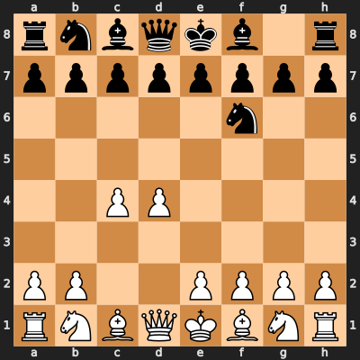
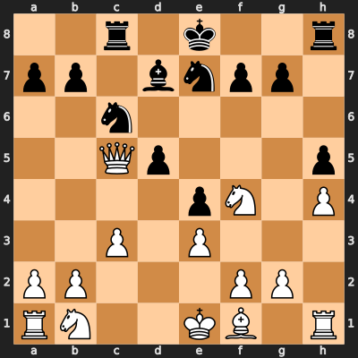

# ♟️ Transformer-Based Chess AI Model
**Achieving Intelligent Gameplay with Limited Compute**

**Karandeep Shoker**
[LinkedIn](https://www.linkedin.com/in/kshoker12/)

### Quick Access
- **[Live Demo](https://main.d12st6uisht1xd.amplifyapp.com)** — Play against the model right now  
- **[Frontend Repo](https://github.com/kshoker12/3D-Chess-App)** — React + 3D visualization  
- **[Backend Repo](https://github.com/kshoker12/Chess-Engine)** — FastAPI + PyTorch inference

## 1 Abstract
This project demonstrates that chess can be effectively modeled as a language problem, where entire games are treated as conversations and individual moves as words. This involves a policy network ($28.2$ million parameter transformer) which predicts the next move autoregressively given the sequence of prior moves. On held-out games, the best move appears in policy's top-$7$ suggestions $\approx 89.2%$ of the time.

To correct tactical or long-term errors, the policy is paired with a value network ($10.7$ million parameter transformer) that scores any given board state with a normalized centipawn value, indicating favourability of the board. This value network was further refined over $10$ cycles of self-play reinforcement learning, where the model generated its own games and labeled them using an oracle model (Stockfish 16), which it then used to fine-tune and iteratively improve its evaluation.

At inference, the two networks supply rapid intuition, while classical search algorithms such as two-step look-ahead, alpha-beta pruning, and Monte Carlo tree search, provide systematic reasoning. The engine's "hard mode" can beat the $2200$-$2400$ Elo bots on Chess.com and can consistently reach complex endgames against $2600+$ ELO opponents, demonstrating strong grandmaster-like intuition.

The entire system was trained and deployed under realistic constraints using Kaggle T4 GPUs, public Lichess data, and serverless cloud infrastructure (AWS Lambda + RunPod) and shows that carefully designed transformers combined with policy-value decomposition and efficient search can deliver high-level chess play without massive computational resources.

## 2 Introduction

### 2.1 Background
Chess has long served as a benchmark for artificial intelligence, testing long-term planning under perfect information. Chess is particularly challenging due to its enormous state space, estimated to be $\approx 10^{46}$ distinct board states, and its average branching factor of $\approx 35$ legal moves per board state which makes exhaustive search computationally infeasible on classical hardware.

Early breakthroughs, such as IBM's Deep Blue defeating world champion Garry Kasparov in 1997, relied on deep alpha-beta search with handcrafted evaluation functions and domain-specific heuristics. Modern engines like Stockfish achieve superhuman strength through highly optimized alpha-beta search combined with an efficiently updatable neural network evaluation (NNUE) trained on massive datasets.

In contrast, AlphaZero [2] demonstrated a paradigm shift where starting from random play and given only the rules, a deep neural network trained solely via self-play reinforcement learning achieved superhuman performance in chess within hours, using a joint policy-value network and Monte Carlo tree search (MCTS).

Recent work has pushed towards efficient alternatives utilizing large transformers trained via supervised learning on oracle evaluations can reach grandmaster-level play without explicit search. These advances show that deep learning, particularly transformers, can mimic high-level chess intuition under realistic computation constraints.

### 2.2 Motivation
This project began with a simple personal goal to build a chess model strong enough to consistently beat me (I'm currently $\approx 1600$ Elo) using only my own trained networks with no external oracle evaluation during inference. 

The spark came while watching Andrej Karpathy's "Let's build GPT" series on nanoGPT, my first deep dive into transformers which introduced me to the ground-breaking paper "Attention Is All You Need" [1], helping me realize the power of self-attention and how transformers can be used to elegantly model both chess board geometry and also model sequences of chess moves as a language problem.

As a result, I reimplemented my existing chess engine using transformers with the broader motivation to explore whether a transformer-based model, trained under realistic compute constraints, can mimic grandmaster-level gameplay. 

Ultimately, I wanted to deepen my understanding of large language model architectures while creating a practical, high-performing chess model.

### 2.3 Project Scope
This project was developed from December 2025 to March 2026 ($\approx 4$ months) as a personal project. 

**Key constraints and scope**:
- Training hardware: Kaggle T4 x2 GPUs only (no multi-node or high-end clusters).
- Model size: 
    - $28.2$ Million parameter policy network
    - $10.7$ Million parameter value network
- Data: Public Lichess sources only — no proprietary datasets.
- Inference: Serverless AWS Lambda with FastAPI backend; RTX A4500 GPU on RunPod for GPU-based serverless inference.
- Goal: Maximize ELO with limited compute + achieve Grandmaster-like intuition.

All training, fine-tuning, and experimentation were performed iteratively on Kaggle notebooks using public datasets (Lichess games + Stockfish evaluations) and PyTorch. The result is a fully self-contained, reproducible system optimized for practical deployment and personal learning.

### 2.4 Document Overview
This report details the design, implementation, and optimization of the chess model:
- **Section 3** describes the policy network.
- **Section 4** covers the value network.
- **Section 5** explains the inference algorithms.
- **Section 6** presents the full system architecture.
- **Section 7** summarizes model strength, key takeaways, future improvements, and a self-reflection on the development process.
- **Section 8** provides the complete list of references.

## 3 Policy Network

### 3.1 Modeling Approach

**UCI Notation**  
Moves in chess are represented in Universal Chess Interface (UCI) format which is a 4-character string consisting of the starting square (file + rank) followed by the destination square (e.g., "e2e4" $\rightarrow$ pawn from e2 to e4). A move resulting in a promotion also appends the piece letter (e.g. "e7e8q" for queen promotion) but for simplicity, we will only consider the starting and destination squares for the UCI move string and the model will always promote to a queen during promotion. The figure below illustrates UCI for three common opening moves (e2e4, e7e5, g1f3).



**Board State from Sequence**  
Any chess board state can be uniquely reconstructed from the sequence of UCI moves played from the starting position. For example, the sequence "d2d4 g8f6 c2c4" leads to the board state shown below.



**Policy Formulation**

Any chess position can be fully determined from the ordered sequence of UCI moves played from the starting position. This allows us to model chess move selection purely as a statistical sequence prediction problem.

Given a sequence of prior moves $S = (s_1, s_2, \dots, s_{t-1})$, the policy network $f_\theta$ computes unnormalized scores (logits) for every possible next UCI move, from which the conditional probability distribution is derived:

$$
p_\theta(s_t \mid s_1, s_2, \dots, s_{t-1}) = softmax \bigl( f_\theta(s_1, s_2, \dots, s_{t-1}) \bigr)
$$

where $s_t$ ranges over all legal UCI moves from the current position, and $\theta$ are the model parameters.

This formulation treats chess gameplay as an autoregressive process where the probability of each move depends only on the history that preceded it. The goal is to learn $f_\theta$ such that $p_\theta$ assigns high probability to strong moves observed in high-quality games, effectively approximating the true conditional distribution $p^*(s_t \mid s_1, \dots, s_{t-1})$ that underlies expert play.

The network is trained by minimizing cross-entropy loss over expert move sequences:

$$
\mathcal{L}(\theta) = \mathbb{E}\_{(s\_1, \dots, s\_{t-1}, s\_t)} \left[ -\log p\_\theta(s\_t \mid s\_1, \dots, s\_{t-1}) \right]
$$

This maximum likelihood objective implicitly learns a distribution that favors grandmaster-level decisions.
### 3.2 Data Collection

The training corpus for the policy network was constructed from high-quality public chess games to expose the model to diverse, strong play while maintaining computational feasibility on Kaggle hardware.

**Primary sources**:
- **Lichess Elite Database** [7]: A curated subset of Lichess games filtered for high-Elo players from June 2020 to November 2025 (originally 2200+, tightened to 2500+ in later years). This dataset emphasizes grandmaster-level and expert play, providing clean, high-quality move sequences.
- **Lichess Standard Database** [6]: Full monthly Lichess dumps (all rating levels). Introduces variety and prevents overfitting to elite patterns, four specific months were sampled at random to build corpus: January 2013, September 2013, July 2014, and November 2014.


The final corpus contains a total $964,921,229$ UCI Moves, providing the policy network with diverse, high quality data to learn robust, generalizable move distributions under constrained compute. All data is public domain (CC0) or freely available from Lichess.org. Below is a dump of the corpus: 

`e7e5 c2c4 g8f6 b1c3 d7d5 c4d5 f6d5 g1f3 b8c6 d2d3 f8e7 g2g3 c8e6 f1g2 f7f6 e1g1 d8d7 a2a3 e8c8 d1a4 c8b8 f1d1 g7g5 c3d5 e6d5 c1e3 d7e6 f3d2 f6f5 g2d5 e6d5 d2f3 f5f4 e3d2 h7h5 d2b4 e7f6 a1c1 c6b4 a3b4 h5h4 c1c5 d5e6 d1a1 a7a6 a4a5 c7c6 f3e5 f6e5 c5e5 e6h3 e5e7 d8d7 e7d7 h3d7 a5e5 | e7e5 e2e4 g8f6 f2f4 f6e4 d1f3 d7d5 d2d3 e4c5 f4e5 b8c6 f3g3 c5e6 g1f3 f8c5 c2c3 d5d4 f1e2 a7a5 b1d2 a5a4 d2e4 c5e7 e1g1 e8g8 c1d2 g8h8 g1h1 e6c5 f3g5 d8e8 f1f2 h7h6 g5f3 c5e4 d3e4 e7c5 f2f1 c8e6 f3h4 h8h7 e2d3 c5b6 h4f5 e6f5 e4f5 e8e5 f5f6 g7g6 d2f4 e5h5 a1e1 a8e8 d3e4 h5b5 g3h3 h6h5 g2g4 f8h8 g4h5 h7g8 h5h6 d4c3 b2c3 b5c4 h3g2 g8h7 g2f3 c4a2 e4d5 a2c2 d5f7 e8e1 f1e1 h8f8 f7d5 f8f6 d5c6 b7c6 e1e7 h7h8 f4e5 c2c1 h1g2 c1g5 f3g3 g5d2 g2h3 | e2e4 e7e5 g1f3 b8c6 b1c3 g8f6 f1c4 f6e4 c4f7 e8f7 c3e4 d7d5 e4g5 f7g8 d2d4 h7h6 g5h3 c8g4 d4e5 c6e5 h3f4 c7c6 h2h3 e5f3 g2f3 g4f5 c1e3 f8b4 c2c3 b4a5 h1g1 d8e8 f4d5 e8f7 d5f4 a8e8 d1b3 a5c7 b3f7 g8f7 f4h5 g7g6 h5g3 f5h3 e1c1 e8d8 d1d8 c7d8 g1h1 h3g2 h1h6 h8h6 e3h6 g2f3 h6e3 |`

Note that '|' is used as padding to separate games in the corpus. Interestingly, the model implicitly learns to ignore context before '|'. 

### 3.3 Architecture 

The policy network is a causal decoder-only transformer, designed for autoregressive next-UCI-move prediction. It follows the GPT-like architecture motivated by nanoGPT [5] and adapted for chess sequence modeling [3]. This architecture prioritizes training stability and inference speed (single forward pass per prediction). To learn more about transformers, I highly recommend reading the revolutionary paper "Attention Is All You Need" [1], NanoGPT [5], and 3Blue1Brown's series on Deep Learning [9]. 

**Key hyperparameters**:
- Embedding dimension (`n_embd`): $500$
- Number of attention heads (`n_head`): $10$
- Number of layers (`n_layer`): $8$
- Context length (`block_size`): $128$ moves
- Dropout: $0.1$ (applied to attention and residual streams)
- Vocab Size: $4033$ ($4032$ UCI moves + padding token)
- Total parameters: $\approx 28.1$ Million

**Core components**:
- Token Embeddings: $500$ Dimensional learned embeddings for each UCI move token to encode semantic meaning of each move. 
- Rotary Position Embedding (RoPE): Applies rotational transformations on the 2D Subspace of the key, query vectors which encodes relative distance between tokens in a sequence, which is very useful for sequence modelling.
- Causal Self-Attention: Multi-head attention with causal masking to ensure autoregressive conditioning, restricting model to only consider past moves when predicting a move. 
- Feed-Forward Blocks: Standard two-layer MLP per block (expansion ratio 4× → GELU → projection), with residual connections and LayerNorm pre-activation.
- Output Head: Linear projection from final hidden state to vocabulary logits, followed by softmax for probability distribution over next UCI move.

Full implementation available at [model.py](https://github.com/kshoker12/Chess-Engine/blob/main/policy_transformer/model.py).

### 3.4 Training

The policy network was trained via supervised next-token prediction (cross-entropy loss) on the UCI sequence corpus described in Section 3.2. Training ran on Kaggle T4 x2 GPUs using PyTorch with mixed precision (AMP) for speed and memory efficiency.

**Optimizer & schedule**:
- Optimizer: AdamW (lr=$3e^{-4}$, weight decay=$1e^{-4}$)
- Learning rate: Cosine decay with linear warmup ($1000$ iterations) and minimum lr=$3e^{-5}$; decay over $100$k iterations.
- Gradient clipping: max norm $1.0$ to stabilize long-sequence training.

**Training details**:
- Context length: $128$ moves
- Batch size: $500$ sequences
- Duration: $100$k iterations
- Train/val split: $90/10$ chronological (no shuffle leakage, preserves temporal structure of games).
- Final cross-entropy loss: $\approx 1.7$ (train/val) — reasonable for UCI token prediction on diverse chess data.

Full training scripts available at [train.py](https://github.com/kshoker12/Chess-Engine/blob/main/policy_transformer/train.py).

### 3.5 Evaluation

The policy network was evaluated on its ability to predict the best moves in unseen game sequences. I sampled $10$K random held-out sequences (not seen during training) and computed how often the model's top-$k$ moves with the highest probability (based on the conditional probability distribution output of the model) included the best move according to Stockfish 16 (State-of-the-art chess engine) which serves as an oracle model.

| Metric     | Accuracy |
|------------|----------|
| Top-1      | 43.16%  |
| Top-3      | 72.05%  |
| Top-5      | 83.52%  |
| Top-7      | 89.24%  |

These figures indicate strong predictive performance since the best move appears in the top-5 suggestions $\approx 83.5$% of the time, and in the top-7 $\approx 89.2$% of the time. This suggests the policy network has learned meaningful patterns of grandmaster-level play from the training corpus. 

## 4 Value Network

### 4.1 Modeling Approach
**Centipawn Evaluation**  
Centipawns (cp) are the standard unit for quantifying positional advantage in chess. Positive cp values indicate advantage for the side to move, while negative values indicate disadvantage. A score of $+100$ cp means the board state is worth roughly one extra pawn; scores above $+300$ cp often signal decisive advantage, and very large positive/negative values indicate near-certain wins or losses (e.g., checkmate in few moves).

**Complexity of Position Evaluation**  
Accurately assessing a chess board state is exceptionally difficult due to the game's enormous state space ($\approx 10^{46}$) and branching factor ($\approx 35$ legal moves). 

Even more challenging is that the true value of a piece depends heavily on its position. A knight in the center forking the king and queen can instantly decide the game, while the same knight sitting passively on the edge of the board is worth much less. A pawn on the seventh rank is far stronger than a pawn on its starting square. Material count alone tells you very little and the real evaluation comes from how pieces interact with the specific board geometry at that moment.

Due to this dynamic, non-linear relationship, even sophisticated handcrafted rules and heuristics fail to generalize across the full range of tactical and strategic nuances that grandmasters intuitively weigh. Deep learning is therefore essential: it learns these complex, position-dependent patterns directly from millions of real games rather than relying on static rules.


**Policy-Value Pairing**  
The policy network has a top-$7$ accuracy of $\approx 89$% so it provides strong candidate moves, but it can still propose tactical blunders or suboptimal long-term plans. However, pairing a policy network which generates candidate moves and a value network which estimates cp scores for the corresponding board states to re-rank the moves reduces obvious errors and selects moves that lead to the most favorable future states, a classic policy-value decomposition used in AlphaZero [2] and modern engines.

**Value Formulation**  
Given a board state $s$, the value network $v_θ(s)$ is trained as a regression model to predict the normalized cp score:

$$
v_\theta(s) \approx \tanh (v^*(s)/400) \in (-1, 1)
$$

where $\theta$ are the model parameters and $v^*(s)\in \mathbb R$ is the oracle cp evaluation from Stockfish, normalized via hyperbolic tangent scaling to stabilize training and provide a probabilistic win/draw/loss interpretation (e.g. +1 ≈ certain win, 0 ≈ equal, -1 ≈ certain loss). 

The network minimizes mean squared error:

$$\mathcal{L}(θ) = \mathbb E_s [ (v_θ(s) - tanh(v^*(s)/400))^2 ]$$

By approximating v*(s), the value network provides a reliable signal for reranking policy suggestions, enabling the system to prefer moves that maximize expected advantage.

### 4.2 Data Collection 
The value network was pre-trained on $\approx 50$ million unique chess board states annotated with Stockfish cp evaluations at depth $22$, sourced from the Lichess Chess Position Evaluations dataset [8], providing high-quality, engine-derived cp labels across a wide range of board states. All data is public domain (CC0) from Lichess.org.

Board states in the dataset were originally encoded as FEN strings which capture entire chess board state in a compact string. Each FEN string was converted into a $64$ dimensional ordinal vector with $13$ possible values:
- $0$ = Empty (Unoccupied square)
- $1$-$6$ = White pieces (Pawn, Knight, Bishop, Rook, Queen, King)
- $7$-$12$ = Black pieces (same ordering) 

This produces a simple, fixed-side input for the network to process. This conversion can be visualized in the example below:

| Board State                      | Ordinal Encoding                                                            |
|----------------------------------------------|---------------------------------------------------------------------------------------------|
|  | <pre><code>0  0 10  0 12  0  0 10<br>7  7  0  9  8  7  7  0<br>0  0  8  0  0  0  0  0<br>0  0  5  7  0  0  0  7<br>0  0  0  0  7  2  0  1<br>0  0  1  0  1  0  0  0<br>1  1  0  0  0  1  1  0<br>4  2  0  0  6  3  0  4</code></pre> |

**Mirroring to White's Perspective**:
Evaluating a chess position accurately depends critically on whose turn it is to move and the same board can shift dramatically in value depending on the side to play. To avoid requiring an explicit side-to-move feature, every position is mirrored so that the side to move is always white. If black is to move, the board is vertically flipped and colors swapped (white ↔ black). This transformation preserves all strategic and tactical properties of the board state, while ensuring the model only evaluates cp for the side whose turn it is. 

### 4.3 Architecture

The value network is a lightweight, full self-attention transformer for chess board evaluation. It treats the $64$-square board as a fixed-length sequence of $64$ tokens (one per square), with each token representing the ordinal-encoded piece on that square as discussed in section 4.2. Full self-attention blocks allows every square to interact directly with every other, effectively capturing global chess geometry and piece relationships.

**Key hyperparameters**:
- Embedding dimension (`n_embed`): $384$
- Number of attention heads (`n_heads`): $6$
- Number of layers (`n_layers`): $6$
- Context length (`block_size`): $64$ squares
- Dropout: $0.1$ (applied to attention and residual streams)
- Total parameters: $\approx 10.7$ Million

**Core components**:
- Piece, Rank & File Embeddings: Learned embeddings for each of the $13$ possible square states ($0$ = empty, $1$–$6$ = white pieces, $7$–$12$ = black pieces) + separate learned embeddings for ranks ($1$-$8$) and files ($A$-$H$). This encodes piece semantics and spatial coordinates explicitly.
- Self-Attention Blocks: Multi-head self-attention (no causal masking) to enable global interactions across the board, leveraging rank/file embeddings to capture chess-specific long-range dependencies 
- Feed-Forward Blocks: Standard two-layer MLP per block (expansion ratio 4× → GELU → projection), with residual connections and pre-LayerNorm for stable training.
- Value Head: Mean-pooling over the 64 token hidden states, followed by a small MLP ($384$ → $192$ → $1$) with Tanh activation to output the normalized value in ($-1$, $1$).

Full implementation available at [model.py](https://github.com/kshoker12/Chess-Engine/blob/main/value_transformer/model.py).

### 4.4 Pre-training

The value network was pre-trained via supervised regression on $\approx 50$ million unique chess positions annotated with Stockfish centipawn evaluations at depth $22$, sourced from the Lichess Chess Position Evaluations dataset [8]. Training ran on Kaggle T4 x2 GPUs using PyTorch with mixed precision (AMP) for speed and memory efficiency.

**Optimizer & schedule**:
- Optimizer: AdamW (lr=$3e^{-4}$, weight decay=$0.01$)
- Learning rate: Cosine decay with linear warmup ($2000$ iterations) and minimum lr=$3e^{-5}$; decay over $50$k iterations.
- Gradient clipping: max norm $1.0$ to stabilize regression on bounded targets.

**Training details**:
- Input: $64$-token ordinal board encoding (mirrored to white's POV)
- Batch size: $2048$ board states
- Duration: $50$k iterations
- Train/val split: $90/10$ chronological (no shuffle leakage, preserves game distribution)
- Final MSE loss: $\approx 0.098$ on preprocessed targets $\tanh(v^*(s)/400) \in (-1, 1)$

This supervised pre-training provides a strong initialization for potential reinforcement fine-tuning (Section 4.5).

Full training scripts available at [train.py](https://github.com/kshoker12/Chess-Engine/blob/main/value_transformer/train.py).

### 4.5 Fine-Tuning (Reinforcement Learning)

To adapt the value network to correct policy network mistakes and improve long-term judgment, the model underwent reinforcement learning via self-play, following the tabula rasa approach introduced in AlphaZero [2]. This process iteratively generates new training data through self-play and fine-tunes the value network using an actor-critic framework.

**Self-Play Loop**  
In each iteration, the current champion value network guides parallel self-play between two instances of the model to generate new training data. Games are played as follows:
- The policy network proposes top-k candidate moves ($k=10$) for the current position.
- For each candidate, the board is simulated and evaluated using the value network and Stockfish 16 (depth $22$) for oracle labels.
- Move selection is asymmetric per game. One side uses a weighted score ($0.7 \times$ value network $ + $ $0.3\times$ Stockfish), while other side relies solely on value network. 
- Both sides occasionally take random exploration steps by sampling from the conditional probability distribution output of the policy network with Dirichlet noise ($\alpha = 0.25$) to promote diverse positions.
- Games are played to completion with $\approx 4500$ games per iteration
- All evaluated board states are labeled with normalized centipawn scores from Stockfish 16 evaluated to depth $22$ and appended to the training set for the next fine-tuning cycle.
- At the end of each fine-tuning cycle, the new self-play data is appended to the corpus of pre-trained data. 

**Champion Evaluation**  
After each fine-tuning iteration, a championship match is conducted where the current champion model plays $400$ games against the new fine-tuned model. The winner (higher win rate) becomes the new champion and is used for subsequent self-play data generation. This ensures continual improvement and prevents regression.

**Training Details**  
- Optimizer: AdamW (lr=$1e^{-4}$, weight decay=$0.01$)
- Learning rate: Cosine decay with linear warmup ($1000$ iterations) and minimum lr=$1e^{-5}$.
- Gradient clipping: max norm $1.0$ to stabilize regression on bounded targets.
- Duration: $10$k iterations per self-play cycle (total 10 cycles).
- Batch composition: $80\%$ previous corpus + $20\%$ new self-play data to prevent catastrophic forgetting.  

Full self-play and fine-tuning scripts available at [self_play.py](https://github.com/kshoker12/Chess-Engine/blob/main/value_transformer/self_play.py) and [retrain.py](https://github.com/kshoker12/Chess-Engine/blob/main/value_transformer/retrain.py).

### 4.6 Metrics
Fine-tuning (Reinforcement Learning) via self-play cycles generates high-quality, model-specific data that exposes the value network to the policy’s strengths and weaknesses. By continually challenging the champion, the process drives the value distribution closer to the true oracle distribution, enhancing its ability to rerank policy suggestions and correct long-term errors. After $10$ self-play loops, the value network became a more reliable partner to the policy, resulting in stronger overall gameplay. 

The table below summarizes progress across iterations, showing validation loss on pre-trained data, new self-play data, and win rate against the previous champion.

| Iteration | Pre-Trained Data Loss | New Self-Play Data Loss | Win Rate vs. Previous Champion |
|-----------|---------------|---------------|-------------------------------|
| 0         | 0.09845       | N/A           | N/A
| 1         | 0.09753       | 0.07822       | 65%                           |
| 2         | 0.09472       | 0.05716       | 72%                           |
| 3         | 0.09168       | 0.06076       | 62%                           |
| 4         | 0.08984       | 0.05355       | 63%                           |
| 5         | 0.08802       | 0.05341       | 70%                           |
| 6         | 0.08425       | 0.04789       | 69%                           |
| 7         | 0.08194       | 0.04719       | 72%                           |
| 8         | 0.08092       | 0.04481       | 67%                           |
| 9         | 0.07893       | 0.04414       | 65%                           |
| 10        | 0.07507       | 0.04383       | 62%                           |

## 5 Algorithms

The policy and value networks provide strong short-term intuition and board evaluation, but as a result of chess's enormous state space ($\approx 10^{46}$ board states), pure feed-forward prediction is insufficient to achieve grandmaster-level play. State-of-the-art engines such as Stockfish and Alpha Zero combine neural networks with classical search algorithms to explore the consequences of each move, avoiding tactical errors. The search algorithms explored in this section include Two-Step Look-Ahead (fast, shallow), Alpha-Beta Pruning (deep, pruned minimax), and Monte Carlo Tree Search (simulation-based, anytime).

### 5.1 Two-Step Look-Ahead Search

**Intuition**  
This is the simplest and fastest algorithm out of the three. Essentially, the policy proposes top-$k$ candidate moves, then the value network evaluates the board state after the opponent's likely best reply derived from policy + value re-rank. Intuitively, for each proposed top-$k$ move, it asks "If I play this, what will the opponent do, and how good will my position be afterward?". This catches immediate tactical blunders and short-term threats with minimal computation. 

**Algorithm**  
```python
def TwoStepLookahead(sequence):
    # Get top-k candidates from policy network (typically k=5–7)
    candidates = policy_top_k(sequence, k=7)

    best_move = None
    best_value = -float('inf')

    for move in candidates:
        # Apply AI move
        new_seq = apply_move(sequence, move)
        # Simulate opponent's best reply (policy + value reranking)
        opp_move = get_best_opponent_move(new_seq)
        # Apply opponent's move
        final_seq = apply_move(new_seq, opp_move)
        # Evaluate final position with value network
        value = value_network(final_seq) 
        if value > best_value:
            best_value = value
            best_move = move

    return best_move
```

**Results & Performance**
Two-step look-ahead provides immediate tactical awareness and reliably avoids common blunders by focusing on short-term threats and opportunities. However, the two-move horizon limits its ability to handle deeper tactics or subtle positional plans that require more foresight.

Inference is extremely fast with $O(k)$ per forward pass for top-$k$ moves, resulting in $<50$ ms per move on AWS Lambda. The algorithm is deployed as the "easy mode" in the application, offering competitive gameplay with low-latency. 


### 5.2 Alpha-Beta Pruning (MinMax Search)

**Intuition**
Alpha-beta pruning is essentially a smart depth-first search (DFS) that explores the game tree to a fixed depth $d$ while assuming the opponent always plays optimally to minimize our advantage. It alternates between maximizing (AI's turn) and minimizing (opponent's turn) values. The key innovation is pruning where branches that cannot possibly improve the current best outcome are skipped, achieving a dramatically lower effective branching factor than naive minimax. At each node, the top-$k$ moves are ordered by policy's prior probabilities, so promising moves are evaluated first, allowing earlier cutoffs and making deeper search practical under limited compute.

**Algorithm**  
```python
# sequence: Sequence of moves played so far
# alpha: AI's best achievable score (initial -1e9)
# beta: Opponent's best achievable score (initial 1e9)
# depth: Remaining search depth
def AlphaBetaPruning(sequence, alpha, beta, depth):
    board = board_from_sequence(sequence)

    if depth == 0:
        return evaluate_value(board)

    # Order candidates by policy prior probability for better pruning
    candidates = sample_policy(sequence)

    for move in candidates:
        new_sequence, new_board = apply_move(sequence, board, move)

        value = AlphaBetaPruning(new_sequence, alpha, beta, depth - 1)

        if board.turn is AI's turn:
            alpha = max(alpha, value)
        else:
            beta = min(beta, value)

        if beta <= alpha:
            break  # Prune remaining branches (cutoff)

    # Return best value depending on whose turn it is
    return alpha if board.turn is AI's turn else beta
```

**Results & Performance**
Alpha-beta pruning delivers significantly smarter and strategic gameplay than shallower methods by effectively reducing the branching factor through pruning and policy-guided move ordering.

Its computational complexity is $O(k^d)$ in the worst case for policy's top-$k$ moves considered at each node until depth $d$, but pruning and prior ordering typically reduces the effective branching factor to $3$, resulting in practical search times of 200–800 ms per move at depth $5$ on RTX A4500 GPU. The algorithm powers the "medium mode" in the application, offering more challenging play for intermediate-to-advanced users.

### 5.3 Monte Carlo Tree Search (MCTS)

**Intuition**  
Monte Carlo Tree Search (MCTS) is a powerful, simulation-based anytime algorithm that excels at exploring chess's vast state space by balancing exploration (trying promising but under-visited paths) and exploitation (focusing on high-value paths), inspired by Alpha Zero [2]. It builds an asymmetric search tree over hundreds of simulations. At each step, it selects the most promising leaf node using the Upper Confidence Bound for Trees (UCT) score:

$$
\text{UCT} = Q + C_{punct} \cdot P \cdot \frac{\sqrt{N_p}}{N_c + 1}
$$

where:
- $Q$ = average value accumulated down this path (exploitation: how good the path has been so far)
- $P$ = prior probability from the policy network (guides toward promising moves)
- $N_p$ = visit count of the parent node
- $N_c$ = visit count of the current child node
- $C_{punct}$ = tunable exploration constant (controls the trade-off)

A high $Q$ favors strong paths already found to be good. A high $P$ or low $N_c$ relative to $N_p$ boosts under-explored but promising children and the constant $C_{punct}$ balances greediness and curiosity. After many simulations, the root child visited most often is selected as the best move, with visit ratios ($N_c / N_p$) approximating posterior probabilities of selecting given move.This approach is highly effective for chess as it can search large spaces adaptively (more simulations = better results) without fixed depth limits.

**Algorithm**  
```python
def MonteCarloTreeSearch(sequence, simulations):
    root_node = get_root(sequence)

    for i in range(simulations):
        node = select_leaf_node(root_node)     # UCT-guided descent to promising leaf
        value = expand_node(node)              # Expand and evaluate leaf with policy + value
        backpropagate(node, value)             # Update visit counts and Q values up the tree

    best_move = None
    best_posterior = 0

    for node in children(root_node):
        posterior = node.N_c / root_node.N_p   # Visit ratio as approximate posterior probability
        if posterior > best_posterior:
            best_move = node.move
            best_posterior = posterior

    return best_move
```

**Results & Performance**
With $400$ simulations per move, MCTS achieves the strongest performance of the three algorithms by adaptively constructing a search tree that balances exploration and exploitation. The algorithm runs in $O(Sd)$ time, where $S$ is the number of simulations performed and $d$ is the average tree depth.

Latency ranges from $5$–$10$ seconds per move on RunPod’s RTX A4500 GPU. This makes it suitable for the application’s “hard mode,” where deeper thinking is prioritized over instant response. The method fully leverages the power of the policy and value networks, making it the most capable search strategy in the system.

## 6 Architecture 

### 6.1 Frontend

The frontend is a Vite-based `React` application offering both 2D and 3D board views that users can toggle between, along with three selectable difficulty levels (Easy, Medium, Hard). The 3D interface is implemented using `React Three Fiber` for seamless `three.js` integration in `React`. `React hooks` (e.g. `useEffect`, `useState`, `useMemo`) ensure optimal performance and re-rendering, `Redux Toolkit` handles state management, `chess.js` enforces game rules, and `React Spring` provides smooth 3D animations.

### 6.2 Backend 

The backend is a lightweight `FastAPI` service with three dedicated endpoints corresponding to the difficulty levels (Easy, Medium, Hard). All model inference and engine logic are implemented in `Python` using `PyTorch`, keeping the service efficient and easy to maintain.

### 6.3 Cloud Architecture

The entire system is fully serverless to optimize cost and scalability. The frontend is hosted on `AWS Amplify`. The Easy mode backend runs on `AWS Lambda` (containerized with `Docker` and deployed via `ECR`). Medium and Hard modes require GPU acceleration for inference and are hosted on RunPod’s serverless GPU platform, ensuring cost-efficient performance for deeper search.

## 7 Conclusions

### 7.1 Model Strength

Model strength was evaluated by simulating $10$ games against Chess.com bots of varying difficulty levels, providing a practical approximation of Elo rating for search algorithm.

| Mode | Algorithm | Estimated strength | Key settings |
|------|-----------|-------------------|--------------|
| Easy | Two-Step Look-Ahead Search | $\approx 1300-1500$ ELO | N/A |
| Medium | Alpha-Beta Pruning / MinMax Search | $\approx 1600-1900$ ELO | Depth $4$ |
| Hard | Monte Carlo Tree Search (MCTS) | $\approx 2200-2400$ ELO | $400$ simulations |

Although the original goal was grandmaster-level performance ($2600+$ Elo), the model did not reach that threshold. However, the Hard mode demonstrates strong grandmaster-like intuition as it consistently reaches endgames against $2600+$ ELO bots and forces complex, competitive positions before being overwhelmed by superior search depth. This confirms that the policy-value combination with MCTS achieves high-level strategic understanding under limited compute constraints.

### 7.2 Takeaways
- **Context Length Matters:** Reducing the policy network’s context window from $256$ to $128$ moves substantially improved performance. In chess, early-game moves quickly lose relevance and a shorter context enables the model to focus on recent patterns and generalize more effectively across game phases.
- **Data Diversity is Essential:** Training exclusively on grandmaster games led to the model struggling against lower-rated opponents by hallucinating/blundering because it had never encountered suboptimal or blunder-prone play during training. Including games across all rating levels is critical for robust, real-world performance.
- **Neural Intuition + Classical Reasoning:** Pure deep learning alone yields suboptimal results. The policy and value networks serve as the model’s “intuition,” rapidly identifying promising moves, while classical search algorithms provide systematic “reasoning” by exploring consequences. Their combination is key to achieving competitive strength under limited compute.
- **Hardware Constraints Drive Innovation:** State-of-the-art performance remains difficult with consumer-grade resources. However, meaningful gains are achievable through careful architectural choices, efficient training schedules, and maximizing the number of iterations within available compute.
- **Machine Learning is Iterative:** Progress emerges through continuous experimentation, research, and incremental refinements. Each cycle of insight and optimization compounds, steadily elevating model capability.

### 7.3 Self-Reflection
As a combined Computer Science and Statistics major, I have long been drawn to the intersection of algorithms, statistical learning, and intelligent systems. This project began during winter break as an exploration of modern large language models. Inspired by 3Blue1Brown’s deep-learning series [9] and Andrej Karpathy’s nanoGPT lecture [5], I realized that chess games could be modeled as sequences of “moves” in a language-like manner. This insight sparked the core idea to treat chess as autoregressive sequence prediction and build a transformer-based engine capable of beating me (I'm $1500-1600$ ELO).

Over four months, the project presented numerous technical and conceptual challenges. Training over $100$ model variants, debugging inference pipelines, and optimizing under Kaggle GPU constraints required persistent iteration and extensive literature review. Each roadblock became an opportunity to refine the architecture, data pipeline, or search strategy. Through this process, I gained hands-on experience with complex architectures such as transformers, reinforcement learning via self-play and actor-critic methods, and the integration of deep learning with classical search algorithms; skills that will help me in developing more intelligent systems in the future.

Beyond technical skills, the project reinforced a deeper appreciation for the iterative nature of machine learning and the power of combining domain knowledge with systematic experimentation. It has strengthened my passion for deep learning and reinforced my commitment to pursuing similar research-oriented projects in the future.

### 7.4 Future Improvements
Several promising directions could further elevate model performance under the same compute constraints:
- **Architecture Optimization for Chess:** The policy transformer would likely benefit from a deeper, narrower design (higher layer count, lower embedding dimension) to emphasize multi-head self-attention over memorization, better capturing long-range move dependencies in chess sequences.
- **Algorithm-Specific Value Networks:** Training separate value models for each search algorithm (Two-Step Look-Ahead, Alpha-Beta, MCTS) would allow each to correct the unique biases introduced by its search strategy, improving reranking accuracy and overall synergy.
- **Superhuman Policy Sequences:** Incorporating game sequences from state-of-the-art engines such as Stockfish and AlphaZero (obtained via computer tournaments) as additional supervised data could distill superhuman move preferences into the policy network, pushing performance beyond human grandmaster level.
- **Pure Tabula Rasa Self-Play:** Extending the current self-play pipeline to a fully tabula-rasa regime (starting from random play with no human data) could discover novel strategies that surpass current human-derived patterns, mirroring the paradigm in AlphaZero [2].

### 7.5 Helpful UBC Course 

The following courses provided essential knowledge that directly supported the design, training, and optimization of this chess AI system.

**STAT 406: Statistical Learning**
Introduced bias-variance tradeoffs, regularization, and deep learning fundamentals, building the intuition needed to balance model capacity and generalization.

**CPSC 340: Machine Learning**
Covered core algorithms, gradient descent, loss functions, and convexity, guiding the selection of appropriate objectives for both policy and value networks.

**CPSC 440: Advanced Machine Learning**
Explored transformers, variational autoencoders, and diffusion models, providing the architectural foundation for implementing and fine-tuning complex transformer architectures in this project.

**CPSC 422: Intelligent Systems**
Focused on reinforcement learning which motivated self-play mechanisms using the actor-critic fine-tuning pipeline used to iteratively improve the value network.

**CPSC 330: Applied Machine Learning**
Emphasized practical pipelines, data preprocessing, hyperparameter tuning, and cross-validation, which streamlined training workflows and prevent overfitting.

**STAT 305: Statistical Modelling**
Taught how to formulate real-world problems as statistical models, helping translate chess evaluation into a well-defined regression task.

## 8 References

This project draws inspiration from foundational work in transformer architectures, self-play reinforcement learning, and treating chess as a sequence modeling problem.

1. **Attention Is All You Need**  
   Vaswani, A., Shazeer, N., Parmar, N., Uszkoreit, J., Jones, L., Gomez, A. N., Kaiser, Ł., & Polosukhin, I. (2017).  
   arXiv:1706.03762 [cs.CL].  
   [https://arxiv.org/abs/1706.03762](https://arxiv.org/abs/1706.03762)  
   *Introduces the Transformer architecture utilizing self-attention — serves as the foundational architecture for both policy and value network.*

2. **Mastering Chess and Shogi by Self-Play with a General Reinforcement Learning Algorithm**  
   Silver, D., Hubert, T., Schrittwieser, J., Antonoglou, I., Lai, M., Guez, A., ... & Hassabis, D. (2017).  
   arXiv:1712.01815 [cs.AI].  
   [https://arxiv.org/abs/1712.01815](https://arxiv.org/abs/1712.01815)  
   *Establishes tabula rasa self-play RL — motivated the pipeline design for fine-tuning value network through self-play.*

3. **ChessGPT: Bridging Policy Learning and Language Modeling**  
   Feng, X., Luo, Y., Wang, Z., Tang, H., Yang, M., Shao, K., Mguni, D., Du, Y., & Wang, J. (2023).  
   arXiv:2306.09200 [cs.LG].  
   [https://arxiv.org/abs/2306.09200](https://arxiv.org/abs/2306.09200)  
   *Proposes treating chess moves as autoregressive sequence prediction via causal language modeling — direct motivation for policy network.*

4. **Mastering Chess with a Transformer Model**  
   Monroe, D., & Chalmers, P. A. (2024).  
   arXiv:2409.12272 [cs.LG].  
   [https://arxiv.org/abs/2409.12272](https://arxiv.org/abs/2409.12272)  
   *Demonstrates that transformers outperform convolution-based models in modeling chess geometry — motivated the value network architecture.*

5. **nanoGPT (Andrej Karpathy)**  
   Karpathy, A. (2022–2023).  
   nanoGPT: The simplest, fastest repository for training/finetuning medium-sized GPTs.  
   Video lecture series: "Let's build GPT: from scratch, in code, spelled out."  
   GitHub: [https://github.com/karpathy/nanoGPT](https://github.com/karpathy/nanoGPT)  
   YouTube: [https://www.youtube.com/watch?v=kCc8FmEb1nY](https://www.youtube.com/watch?v=kCc8FmEb1nY)  
   *Practical transformer implementation in PyTorch — served as baseline transformer implementation + motivated efficient training and autoregressive design.*

6. **Lichess Database**  
   Lichess.org (ongoing, monthly releases).  
   Lichess Game Database.  
   https://database.lichess.org/  
   *Primary source of millions of rated chess games used for pre-training and fine-tuning. All data released under CC0 public domain license.*

7. **Lichess Elite Database**  
   Nikonoel (ongoing, monthly updates; maintained since 2020).  
   Curated high-Elo Lichess games (filtered 2500+ vs. 2300+ rated players, standard time controls).  
   https://database.nikonoel.fr/  
   *Filtered subset of Lichess games focusing on elite play — valuable source for training the policy network on high-quality, grandmaster-like move sequences.*

8. **Lichess Chess Position Evaluations**  
   Lichess.org (ongoing, monthly releases; Hugging Face mirror by Lichess, last updated January 2026).  
   chess-position-evaluations dataset.  
   Hugging Face: [https://huggingface.co/datasets/Lichess/chess-position-evaluations](https://huggingface.co/datasets/Lichess/chess-position-evaluations)  
   Original source: [https://database.lichess.org/#evals](https://database.lichess.org/#evals)  
   License: CC0-1.0  
   *Massive dataset of ~844 million Stockfish-evaluated chess positions — primary source for supervised pre-training of value network on ~50 million positions.*

9. **Neural Networks (3Blue1Brown)**  
   Sanderson, G. (3Blue1Brown). (2017).  
   YouTube playlist: Neural networks.  
   [https://youtube.com/playlist?list=PLZHQObOWTQDNU6R1_67000Dx_ZCJB-3pi](https://youtube.com/playlist?list=PLZHQObOWTQDNU6R1_67000Dx_ZCJB-3pi)  
   *Introductory deep-learning playlist for background and intuition.*