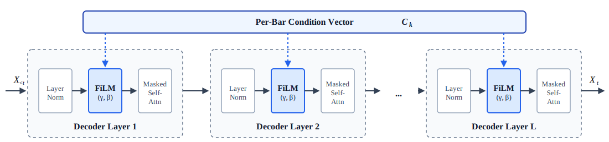
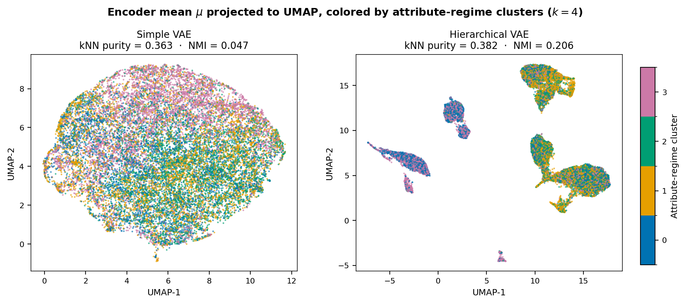

# 🎵 Piano Music Generative Models
**Exploring Generative Models for Controllable Symbolic Piano Music Generation (Plain Transformer, VAE, & Hierarchical VAE)**

**Karandeep Shoker**  
[LinkedIn](https://www.linkedin.com/in/kshoker12/)

### Quick Access
- **[MusicGen Dashboard](https://kshoker12.github.io/Music-Generation-VAE/)** — Interactive UI to generate 8-bar Piano excerpts with Controllable Attributes  
- **[GitHub Repo](https://github.com/kshoker12/Music-Generation-VAE)** — Kaggle Training Notebooks, Model Definitions, and Inference Logic

<!--
[NARRATIVE ALIGNMENT - OVERALL TONE]
- Tone: Precise, intuitive, no fluff. Direct to the point.
- Strategy: "Math -> Meaning". Every statistical equation gets an intuitive, real-world translation.
- The Flex: Highlighting the engineering required to train a complex hierarchical model on a single 16GB Kaggle T4 GPU[cite: 1, 8].
-->

## Abstract

This project explores symbolic piano music generation as a generative sequence modeling problem, using classical piano as an empirical testbed where strict local structure across musical bars must coexist with global themes that evolve naturally over time. Three architectures of increasing complexity are compared: (i) a Plain Transformer Decoder conditioned strictly on explicit user-defined attributes; (ii) a Simple Variational Autoencoder (Simple VAE) with a single global latent \\(Z_p\\) shared across all bars; and (iii) a Hierarchical Variational Autoencoder (Hierarchical VAE) that unrolls \\(Z_p\\) into bar-specific latent instructions \\(Z_k\\) through a recurrent Gated Recurrent Unit (GRU) Conductor. 

Each musical bar exposes four user-controllable attributes measured independently: polyphony rate, rhythmic intensity, velocity dynamics, and note density. In all models, the per-bar condition vector \\(C_k\\) combines these attribute embeddings with latent information in the VAE variants, and is injected into every Transformer decoder layer via Feature-wise Linear Modulation (FiLM) to condition the decoder, enabling controllable generation. 

A central challenge for the VAE variants is posterior collapse: high-capacity autoregressive decoders such as Transformers can learn to ignore latent variables and rely on local token history alone, defeating the purpose of a global bottleneck. Both VAE models mitigate this through complementary design choices: a \\(3{:}1\\) FiLM conditioning ratio within \\(C_k\\) (\\(384\\) dimensions to the projected latent, \\(128\\) to the controllable attributes) that encourages the decoder to route global structure through \\(Z_p\\); and a collapse-aware Evidence Lower Bound (ELBO) loss combining cyclical \\(\beta\\)-annealing to dynamically scale the Kullback-Leibler (KL) term with per-dimension KL free bits (hinge loss), preserving \\(\approx 100\\)–\\(110\\) bits of information through the bottleneck per sample during training.

Models are trained on \\(\approx 1.43\\) million eight-bar REMI (Revamped MIDI)-tokenized excerpts from MAESTRO ([Hawthorne et al., 2019](#ref-1)) and GiantMIDI-Piano ([Kong et al., 2020](#ref-2)), filtered to \\(4/4\\) time signatures. The Plain Decoder is trained with reconstruction cross-entropy only; the VAE variants jointly optimize reconstruction and the regularized KL Divergence term of the ELBO loss. The \\(\approx 44.3\\)M-parameter Hierarchical VAE is trained end-to-end on a \\(16\\)GB Kaggle T4x2 GPU using memory-mapped streaming, batch-time target derivation, \\(16\\)-bit floating-point (FP16) mixed precision, and gradient accumulation.

Evaluation of the models spans reconstruction and latent usage (teacher-forced cross-entropy and KL usage), attribute controllability (exact-bin accuracy vs. monotonic Pearson \\(r\\)), latent-space organization (\\(k\\)-nearest neighbors (kNN) purity, Normalized Mutual Information (NMI), Uniform Manifold Approximation and Projection (UMAP) visualization), and blind listener preference (\\(N=17\\)) across three prompts (Virtuoso, Lullaby, Crescendo). The Plain Decoder, which has no encoder and no \\(Z_p\\), attains the sharpest exact-bin adherence (\\(0.898\\)) but can steer generation only through the four attribute dials, not a learned piece-level theme. The Simple VAE maintains an active \\(Z_p\\) bottleneck yet applies the same global latent projection at all eight bars, matching Plain reconstruction (\\(1.695\\) vs. \\(1.693\\) nats cross-entropy) while transmitting \\(\approx 100\\) bits of latent information. The Hierarchical VAE unrolls \\(Z_p\\) into evolving bar-specific instructions, achieving the best cross-entropy (\\(1.678\\) nats), the strongest monotonic attribute scaling (\\(r = 0.943\\)), the highest latent-structure scores (\\(4\times\\) NMI over Simple), and \\(\approx 110\\) bits of KL bandwidth. In listening tests, preference depends on prompt: the Simple VAE wins stable mood-driven excerpts (Lullaby, \\(15/17\\) first-place votes), while the Hierarchical VAE wins dense, virtuosic ones (Virtuoso, \\(11/17\\)). The central lesson is that generative quality depends as much on architectural design as on parameter scale: by unrolling one global theme into distinct bar-level instructions, the Hierarchical VAE delivers the strongest quantitative gains and the most coherent long-form excerpts despite only modest additional capacity over the Simple VAE.

## 1 Introduction

### 1.1 Motivation

<!-- 
[NARRATIVE ALIGNMENT] 
- Frame the project: Originating from CPSC 440, evolving into an exploration of sequence modeling.
- The "Resource Crucible": Emphasize that the 16GB Kaggle T4 limit wasn't a roadblock, but a catalyst for elegant architectural and data-pipeline design[cite: 8]. Focus on engineering efficiency over raw compute.
-->
Generative AI models have become a game-changer in recent years. Large Language Models (LLMs) generate textual responses, Image Generation Models turn prompts into highly detailed visuals, and Coding Agents produce executable software, enabling developers to reach new levels of productivity. Originating as my CPSC 440 project at the University of British Columbia (UBC), this work explores increasingly complex generative sequence modelling architectures, using classical piano music as an empirical testbed.

Music generation is a challenging sequence modelling task: the model must maintain local coherence, obey strict structural rules, and sustain an overarching theme that evolves naturally over time. Controllable generation adds further difficulty: the model must honor both a global musical theme and explicit user-defined attributes, all while remaining coherent to human listeners.

This work tackles these domain-specific challenges by starting with a baseline architecture and progressively adding upgrades grounded in musical intuition. Three architectures are evaluated:
1. **Plain Transformer Decoder:** A baseline generative model conditioned strictly on explicit user-defined attributes, serving as the "Musician" that plays according to its conditioning.
2. **Simple Variational Autoencoder (VAE):** Introduces a global latent space, the "Composer," from which global themes are sampled to condition the decoder alongside user-defined attributes, encouraging coherent piece-level generation.
3. **Hierarchical VAE:** Introduces a recurrent network, the "Conductor," that unrolls the Composer's global theme into bar-level instructions for the decoder, yielding more creative and dynamic music.

Furthermore, this research serves as a blueprint for efficient ML systems design. The entire training pipeline was strictly constrained to a \\(16\\)GB Kaggle T4x2 GPU. Rather than relying on raw compute, this hardware ceiling is treated as a crucible for highly optimized, production-ready engineering, leveraging mixed-precision training, offline memory-mapped data streaming, and cyclical hyperparameter annealing to stabilize the learning process.

### 1.2 Musical Background

<!--
[NARRATIVE ALIGNMENT]
- Intuition first: Explain bars, 4/4 time, and the REMI token format simply. 
- Controllable Attributes: Define Polyphony Rate, Rhythmic Intensity, Velocity Dynamics, and Note Density. Frame these as the "control knobs" we want to hand to the user[cite: 8].
-->

This project generates symbolic classical piano music. To understand how the models process, structure, and control the music, it's important to define a few foundational musical concepts.

Bars and Time Signatures: Music is modelled in bars because they are the natural clock of Western piano music. Intuitively, if a song is a paragraph, a bar is a single sentence, it organizes individual notes into a cohesive musical idea. By strictly filtering our dataset to a \\(4/4\\) time signature, it's guaranteed that every bar contains exactly four beats (\\(16\\) discrete position slots). This enforces mathematical uniformity across the dataset, guaranteeing predictable sequence lengths and providing a stable temporal grid for our models to inject conditioning vectors. The models process and generate music in fixed \\(8\\)-bar excerpts, capturing a complete structural arc while keeping sequence lengths manageable for limited compute.

**Controllable Attributes:** To allow for user-directed generation, I utilize four mathematically measurable, bar-wise control signals, quantized into eight ordinal bins (\\(0-7\\)):

- **Polyphony Rate:** Controls the number of piano keys pressed simultaneously. Low polyphony leads to single-note melodies, and high polyphony leads to thick, multi-note chords.  
- **Rhythmic Intensity:** Controls how continuously the piano is played. Low rhythmic intensity leads to music with frequent pauses, and high rhythmic intensity leads to a constant, unbroken rhythm.  
- **Velocity Dynamics:** Controls how much loudness varies within a bar (measured by the standard deviation of velocity values). Low velocity leads to a more constant music volume, and high velocity leads to high variation in music volume. 
- **Note Density:** Controls the total number of notes played in a single bar. Low note density leads to sparse music with few notes, and high note density leads to fast music packed with notes.  

### 1.3 Dataset, Preprocessing, & Tokenization

<!-- 
[NARRATIVE ALIGNMENT]
- Data sources: MAESTRO[cite: 7] & GiantMIDI[cite: 8]. 
- Engineering Flex: Highlight the offline preprocessing. Mention the `uint16`/`uint8` memory-mapped arrays (memmap)[cite: 8]. Explain *why*: to bypass CPU RAM bottlenecks and keep the GPU saturated. This proves production-level system design.
-->

The models are trained on a curated corpus of classical piano performances from the MAESTRO ([Hawthorne et al., 2019](#ref-1)) and GiantMIDI-Piano ([Kong et al., 2020](#ref-2)) datasets. Pieces are partitioned at the piece level into an \\(80/10/10\\) train/validation/test split. After filtering to \\(4/4\\) time signatures and applying \\(12\\)-key offline transposition on the training set, preprocessing yields \\(\\approx 1.43\\) million \\(8\\)-bar training chunks (\\(\\approx 1.46\\) billion tokens at \\(1024\\) tokens per chunk), alongside \\(20{,}135\\) validation and \\(21{,}105\\) test chunks, the latter reflecting piece-level splits without the same key augmentation.

To maximize the quality of the training signal, the raw MIDI undergoes a strict preprocessing pipeline. Sequences are trimmed of leading silence, sliced into fixed \\(8\\)-bar windows, and filtered to remove musically sparse or inactive chunks. Additionally, a quantization process occurs where the four controllable attributes from Section \\(1.2\\) are mathematically calculated for every bar and mapped into eight discrete bins (\\(0-7\\)) based on distributions derived strictly from the training set.

**Systems Optimization (Memmaps):** To bypass severe CPU RAM bottlenecks and keep the GPU fully saturated, monolithic PyTorch tensors are avoided. Instead, the final tokenized sequences and attribute labels are stored as memory-mapped binary arrays (`uint16` and `uint8` memmaps). Attributes are pre-binned offline; the DataLoader streams token slices directly from disk, with autoregressive targets derived at batch time (Section \\(2.4\\)).

**Tokenization:** The music is tokenized into REMI (Revamped MIDI) using the `miditok` library. Utilizing a highly optimized \\(195\\)-token vocabulary, REMI translates the notes into discrete sequences capped at \\(1024\\) tokens. Crucially, the vocabulary includes an explicit `Bar` token to mark bar boundaries. During autoregressive generation, encountering this hard boundary acts as a programmatic trigger, commanding the decoder to instantly switch its conditioning to the next bar's controllable attributes, allowing the music to evolve dynamically with the progression of bars. The complete end-to-end preprocessing pipeline, memory-mapping layout (Table B2), REMI vocabulary (Table B3), and grammar masking rules (Table B4) are provided in [Appendix B](#appendix-b-data-tokenization-and-grammar-masking).

### 1.4 Statistical Modelling Approach

<!--
[NARRATIVE ALIGNMENT]
- Introduce the "Composer, Conductor, Musician" metaphor here to ground the math.
- Plain Decoder (The Musician alone): Generates $X_{1:T}$ autoregressively conditioned only on attributes $A_{1:K}$.
- Simple VAE (The Composer & Musician): Introduces global latent $Z_p$ (The Composer's general vibe).
- Hierarchical VAE (Composer, Conductor, Musician): The Conductor unrolls the global $Z_p$ into bar-level instructions $Z_{1:K}$. This bridges abstract style with local coherence.
-->
The architectural progression explores how to enforce global structure on a localized generator.
- **The Plain Decoder (The Musician Alone):** Without latent variables, the model relies purely on local sequence history and explicit controllable attributes (polyphony, rhythmic intensity, velocity dynamics, note density). Generation is modeled by the autoregressive conditional likelihood \\(P_\theta(X|A) = \prod_{t=1}^T P_\theta(X_t | X_{<t}, C_{k(t)})\\). For each bar \\(k\\), the four binned attributes are embedded and linearly projected to form a \\(512\\)-dimensional condition vector: \\(C_k = \text{Linear}(A_k) \in \mathbb{R}^{512}\\). Musically, this yields compositions that rigidly obey local attribute dials (e.g., playing fast and loud when instructed), but tend to wander without a cohesive, long-term melody.
- **The Simple VAE (The Composer & Musician):** An approximate posterior \\(Q_\phi(Z_p|X)\\) infers a single, continuous global latent \\(Z_p \sim \mathcal{N}(0, I)\\) (The Composer). This condenses the entire \\(8\\)-bar chunk's overarching musical identity into a \\(128\\)-dimensional bottleneck. \\(Z_p\\) is statically projected to \\(Z_g \in \mathbb{R}^{384}\\) and concatenated with attributes to form \\(C_k = [Z_g; A_k] \in \mathbb{R}^{512}\\). However, projecting a global latent as a static, uniform condition across all \\(8\\) bars makes it difficult to cleanly separate shifting local stylistic features from the global theme. Musically, this yields compositions that establish a consistent overarching mood or theme, but local details often blur together.
- **The Hierarchical VAE (Composer, Conductor, Musician):** To bridge the compact global representation \\(Z_p\\) with the precise, bar-by-bar sequence variations required by the decoder, a deterministic \\(2\\)-layer GRU (The Conductor) initializes from \\(Z_p\\) and unrolls learned bar-index embeddings into bar-specific condition vectors \\(\\{Z_k\\}&#95;{k=1}^{8} \in \mathbb{R}^{384}\\). The condition becomes \\(C_k = [Z_k; A_k] \in \mathbb{R}^{512}\\). The decoder models \\(P_\theta(X|Z_p, A) = \prod_{t=1}^T P_\theta(X_t | X_{<t}, C_{k(t)})\\), ensuring long-range coherence without sacrificing local harmonic guidance. Musically, this yields highly dynamic compositions that maintain a clear, evolving long-term structure while executing precise, bar-by-bar stylistic shifts.

<figure id="fig-plates-sec-1-4">
  

    

      
      
Left: Plain Decoder

    

    

      
      
Middle: Simple VAE

    

    

      
      
Right: Hierarchical VAE

    

  

  <figcaption class="plates-caption">
    Graphical model (plate) view of the three architectures in Section 1.4. Shaded nodes are observed token variables; unshaded circles are latent or deterministic latents; double-bordered circles denote deterministic transformations. <strong>Left (Plain Decoder):</strong> the token sequence \(X = (X_1, \ldots, X_T)\) is generated autoregressively with per-bar attributes \(A_{1:K}\) mapped to \(C_k = \text{Linear}(A_k)\). <strong>Middle (Simple VAE):</strong> a global latent \(Z_p \sim \mathcal{N}(0, I)\) is inferred and projected to \(Z_g\); decoding uses \(C_k = [Z_g; A_k]\). <strong>Right (Hierarchical VAE):</strong> \(Z_p\) is deterministically unrolled by the Conductor into \(\{Z_k\}_{k=1}^{8}\); decoding uses \(C_k = [Z_k; A_k]\). In all models, \(k(t)\) indexes the bar of token \(t\).
  </figcaption>
</figure>

### 1.5 Related Work

<!--
[NARRATIVE ALIGNMENT]
- MusicVAE[cite: 2]: Acknowledge the hierarchical decoder to fight collapse, but note our shift to Transformers and explicit controls[cite: 1].
- MuseMorphose[cite: 5]: Acknowledge segment-level conditioning, but explicitly contrast their "in-attention" addition with our robust FiLM (Feature-wise Linear Modulation) multiplicative conditioning[cite: 1, 4].
- EmoMusicTV[cite: 3]: Connect to their emphasis on cross-bar coherence via hierarchical latents.
-->
This project builds upon a rich lineage of sequence modeling techniques, specifically targeting the intersection of latent variable models and symbolic music generation.

**MusicVAE (Hierarchical VAEs and Posterior Collapse):** Roberts et al. introduced MusicVAE ([Roberts et al., 2018](#ref-3)), demonstrating that using a hierarchical recurrent decoder is highly effective at mitigating posterior collapse when generating long sequences. While adopting their foundational principle of hierarchical decoding to maintain long-range structure, this work's architecture shifts the generative backbone from LSTMs to a causal Transformer to leverage superior self-attention mechanisms, and further augments the generation process with explicit user-defined attribute controls.

**MuseMorphose (Segment-Level Conditioning):** This work's approach to bar-level control is closely related to MuseMorphose ([Wu & Yang, 2021](#ref-4)), a Transformer-based VAE that elegantly handles segment-level conditioning for musical attributes (like rhythmic intensity and polyphony). However, a critical architectural difference lies in the conditioning mechanism. While MuseMorphose injects its conditions into each self-attention layer of the transformer using an "in-attention" additive mechanism, this work's architecture utilizes Feature-wise Linear Modulation (FiLM) ([Perez et al., 2018](#ref-5)). FiLM is leveraged as a stronger multiplicative enforcer to strictly bind the decoder to the latent space, the mathematical mechanics of which are detailed in Section 2.1.

**EmoMusicTV (Connecting Musical Ideas Across Bars):** Finally, this work's use of a deterministic recurrent network (The Conductor) to translate global latents into sequential, bar-level instructions shares structural DNA with models like EmoMusicTV ([Ji & Yang, 2024](#ref-6)). Their work heavily emphasized the use of hierarchical latents to maintain a cohesive, evolving musical narrative across multiple bars. This validates this work's approach to bridging abstract global themes (The Composer) with localized, bar-by-bar sequence execution.

### 1.6 Paper Overview

The remainder of this paper is organized as follows.

- **Section 2 (Architecture)** formally instantiates the three models from Section \\(1.4\\): the Plain Decoder ([Section \\(2.1\\)](#21-plain-transformer-decoder)) with FiLM-conditioned autoregressive decoding on per-bar attributes; the Simple VAE ([Section \\(2.2\\)](#22-simple-variational-auto-encoder)) with a static global latent \\(Z_p\\); and the Hierarchical VAE ([Section \\(2.3\\)](#23-hierarchical-variational-auto-encoder)) with a GRU Conductor that unrolls \\(Z_p\\) into bar-specific latents \\(Z_k\\). Both VAE variants optimize a modified ELBO loss with cyclical \\(\beta\\)-annealing of the KL term and KL free bits to combat posterior collapse, and share a \\(3{:}1\\) latent-to-attribute split in the condition vector \\(C_k\\). Section \\(2.4\\) documents the resource-constrained Kaggle T4x2 training pipeline (memory-mapped streaming, batch-time targets, FP16 mixed precision, and gradient accumulation).

- **Section 3 (Results)** evaluates the architectural progression across four axes: reconstruction fidelity and latent bandwidth ([Section \\(3.1\\)](#31-reconstruction-fidelity-and-latent-capacity)); attribute controllability, contrasting exact-bin accuracy with monotonic Pearson correlation ([Section \\(3.2\\)](#32-attribute-controllability)); latent-space organization via kNN purity, NMI, perturbation stability, and exploratory UMAP projections ([Section \\(3.3\\)](#33-latent-space-structure), [Appendix C](#appendix-c-global-latent-alignment-nmi)); and blind listener preference across three curated prompts, Virtuoso, Lullaby, and Crescendo ([Section \\(3.4\\)](#34-subjective-analysis), [Appendix A](#appendix-a-subjective-evaluation-videos)).

- **Section 4 (Conclusion)** synthesizes the architectural hierarchy and key quantitative and subjective findings ([Section \\(4.1\\)](#41-summary)). Section \\(4.2\\) discusses limitations of the \\(4/4\\) time signature filtering, \\(8\\)-bar scope, the \\(3{:}1\\) FiLM conditioning trade-off, and subjective evaluation bounds, and outlines future work on longer context, balanced latent disentanglement, and LLM-guided control via the [MusicGen Dashboard](https://kshoker12.github.io/Music-Generation-VAE/). Section \\(4.3\\) closes with a personal reflection on the project's coursework origins, research-to-implementation workflow, and lessons on architectural interfaces. Implementation details appear in [Appendix A](#appendix-a-subjective-evaluation-videos)–[D](#appendix-d-training-hyperparameters-and-checkpoints).

## 2 Architecture

### 2.1 Plain Transformer Decoder 
<!-- Math -> Meaning: Autoregressive generation $P_\theta(x_t | x_{<t}, A)$. Architecture breakdown. -->

The baseline architecture functions as the "Session Musician." It is a non-latent autoregressive model highly capable of generating token sequences that adhere perfectly to the structural rules provided by its conditioning. Given explicit, localized instructions, such as polyphony, rhythmic intensity, velocity dynamics, and note density, the Musician executes them with precision, processing the sheet music exactly one measure at a time.

**The Musician: Autoregressive Sequence Generation**

The core generative engine is a causal Transformer decoder ([Vaswani et al., 2017](#ref-7)) (\\(\approx 22.8\text{M}\\) parameters, \\(N=6\\) layers, \\(n_{\mathrm{embed}}=512\\), and a maximum sequence block size of \\(T=1024\\) tokens). To condition the generation process, the model relies strictly on explicit controllable attributes. For a given bar \\(k\\), four attribute variables (introduced in Section 1.2) quantized into 8 bins (\\(0\\)–\\(7\\)) are utilized: polyphony (\\(a_k^{\mathrm{poly}}\\)), rhythmic intensity (\\(a_k^{\mathrm{rhythm}}\\)), velocity dynamics (\\(a_k^{\mathrm{vel}}\\)), and note density (\\(a_k^{\mathrm{dens}}\\)). During training, these variables are computed directly from the raw MIDI data, whereas during inference, they serve as user-defined inputs.

To construct the unified attribute vector \\(A_k\\), these four quantized discrete variables are passed through learned embedding tables. Since each of the 8 bins possesses its own learned parameter weights, this operation maps each discrete integer into a continuous 32-dimensional vector. These embedded representations are then concatenated to form a 128-dimensional vector:

$$
A_k = [\mathrm{Embed}(a_k^{\mathrm{poly}}); \mathrm{Embed}(a_k^{\mathrm{rhythm}}); \mathrm{Embed}(a_k^{\mathrm{vel}}); \mathrm{Embed}(a_k^{\mathrm{dens}})] \in \mathbb{R}^{128}
$$

This attribute vector \\(A_k\\) is linearly projected to match the network's embedding dimension, forming the final condition vector \\(C_k\\):

$$
C_k = \mathrm{Linear}(A_k) \in \mathbb{R}^{512}
$$

To guarantee the decoder respects these attributes, \\(C_k\\) is dynamically injected into the generation of every token within bar \\(k\\) via a Feature-wise Linear Modulation (FiLM) mechanism (detailed below). With this conditioning in place, the model estimates the probability of the discrete musical sequence \\(X = (X_1, \ldots, X_T)\\), representing a flattened stream of MIDI events (e.g. notes, velocities, and time shifts), by factorizing the joint probability autoregressively:

$$
P_\theta(X \mid A) = \prod_{t=1}^{T} P_\theta(X_t \mid X_{1:t-1}, C_{k(t)})
$$

where \\(k(t)\\) denotes the specific bar index corresponding to timestep \\(t\\). During inference, the decoder utilizes this estimated conditional probability distribution \\(P_\theta(X \mid A)\\) to autoregressively generate the piece step-by-step. At each timestep, the probability distribution is evaluated over all possible musical tokens, paired with programmatic masking to filter out illegal token transitions (detailed in [Appendix B](#appendix-b-data-tokenization-and-grammar-masking)) and top-\\(p\\) sampling to select the next note. Crucially, the vocabulary includes an explicit `Bar` token. When this token is generated, it serves as a hard structural boundary, dynamically switching the active FiLM condition vector to the next bar's attributes \\(C_{k+1}\\).

Since this architecture lacks a latent space, it is trained entirely using standard cross-entropy loss (\\(\mathcal{L}&#95;{\mathrm{CE}}\\)) with teacher-forcing, optimizing the network to maximize the log-likelihood of the ground truth tokens:

$$
\mathcal{L}&#95;{\mathrm{CE}} = -\mathbb{E}\left[ \sum_{t=1}^{T} \log P_\theta(X_t \mid X_{1:t-1}, C_{k(t)}) \right]
$$

**Feature-wise Linear Modulation (FiLM)**

A central challenge in conditional sequence modeling is ensuring that the high-capacity causal decoder actively utilizes the condition vector \\(C_k\\), rather than lazily defaulting to local token history. To enforce this, the architecture injects \\(C_k\\) directly into every Transformer layer using Feature-wise Linear Modulation (FiLM) ([Perez et al., 2018](#ref-5)).

<figure id="fig-film-pipeline">
  
  <figcaption>
    The FiLM conditioning pipeline. The per-bar condition vector \(C_k\) is globally broadcast and injected into the affine FiLM transformation block within every Transformer layer, modulating the normalized hidden states prior to self-attention.
  </figcaption>
</figure>

Given an intermediate hidden state \\(h_l^t \in \mathbb{R}^{d}\\) at layer \\(l\\) and timestep \\(t\\), the FiLM operation applies an element-wise affine transformation to the normalized activations:

$$
\mathrm{FiLM}(h_l^{t} \mid C_k) = (1 + \gamma_l(C_k)) \odot h_l^{t} + \beta_l(C_k)
$$

where \\(\gamma_l(C_k) = \mathrm{Linear}&#95;\gamma(C_k)\\) and \\(\beta_l(C_k) = \mathrm{Linear}&#95;\beta(C_k)\\) are learned linear projections mapping \\(C_k\\) to scale and shift vectors, and \\(\odot\\) denotes the Hadamard product. The \\((1 + \gamma_l)\\) form recovers the identity map when \\(\gamma_l \approx 0\\), while still permitting strong multiplicative modulation of normalized activations.

The structural necessity of this multiplicative scaling is best understood when contrasted with purely additive conditioning. Models such as MuseMorphose ([Wu & Yang, 2021](#ref-4)) utilize an "in-attention" additive mechanism, mathematically adding a projected condition directly to the hidden states (\\(\tilde{h}_l^t = h_l^t + W_C C_k\\)). While this shifts the mean of the activations, a purely additive signal is highly susceptible to being washed out by subsequent normalization layers, allowing the powerful decoder to easily bypass the conditioning.

FiLM circumvents this limitation by element-wise scaling of the hidden representations. Acting as a strict gating mechanism, it can amplify or mute specific feature maps based on \\(C_k\\). This operation inextricably links the generated sequence to the conditioning vector at every depth of the network, mathematically forcing the decoder to respect the controllable attributes. 

While this model achieves high accuracy in following the conditioning \\(C_k\\), it is fundamentally short-sighted. It adheres strictly to the explicit controllable attributes, frequently resulting in musical outputs that wander aimlessly without a cohesive, long-term melody.

**Architectural Overview**
- Components: Causal Transformer Decoder (\\(\approx 22.8\text{M}\\))

- Total Parameters: \\(\approx 22.8\text{M}\\)

- Implementation: [plain_transformer.py](https://github.com/kshoker12/Music-Generation-VAE/blob/main/ml/src/musicgen/models/plain_transformer.py)

<figure id="fig-plain-training" class="arch-diagram">
  
  <figcaption>
    Plain Transformer Decoder training architecture. Ground-truth tokens \(X\) and past tokens \(X_{\lt t}\) feed a causal Transformer decoder; per-bar attributes are embedded into \(A_k\), projected to \(C_k\), and injected via FiLM at every layer. The model is trained with teacher-forcing cross-entropy against the ground-truth sequence.
  </figcaption>
</figure>

<figure id="fig-plain-inference" class="arch-diagram">
  
  <figcaption>
    Plain Transformer Decoder inference architecture. User-defined bar attributes are embedded into \(A_k\), projected to \(C_k = \mathrm{Linear}(A_k)\), and injected via FiLM at every decoder layer. The causal decoder autoregressively generates \(X' = (X'_1, \ldots, X'_T)\), conditioning each step on past generated tokens \(X'_{\lt t}\) and bar control \(C_{k(t)}\).
  </figcaption>
</figure>

### 2.2 Simple Variational Auto-Encoder 
<!-- Math -> Meaning: Introduce $Q_\phi(z_p|x)$. Explain the reparameterization trick briefly and intuitively. -->

To give the Musician a sense of overarching direction, the architecture is expanded into a Simple Variational Autoencoder ([Kingma & Welling, 2014](#ref-8)). This introduces the concept of a "Composer": an inference network that condenses the entire musical piece into a continuous global latent space ($Z_p$). The Composer provides an abstract structural blueprint, dictating the overarching stylistic theme and mood, which is then combined with the explicit bar-level attributes to guide the Musician throughout the generation process.

**The Composer: Global Latent Inference**

This architecture introduces an inference network to capture this global theme, paired with the generative decoder established in Section 2.1. The inference network is a bidirectional Transformer encoder (\\(\approx 19.7\text{M}\\) parameters, \\(N=6\\) layers, \\(n_{\mathrm{embed}}=512\\)). By utilizing unmasked self-attention across the entire 8-bar input sequence \\(X\\), the encoder effectively analyzes both past and future musical context. A dedicated `[CLS]` token is prepended to the input sequence, and its final hidden state serves as the pooled representation of the entire sequence. This `[CLS]` token is linearly projected to parameterize the mean \\(\mu \in \mathbb{R}^{128}\\) and log-variance \\(\log(\sigma^2) \in \mathbb{R}^{128}\\) of a 128-dimensional approximate posterior distribution:

$$
Q_\phi(Z_p \mid X) = \mathcal{N}(Z_p; \mu(X), \operatorname{diag}(\sigma^2(X)))
$$

By forcing the entire 8-bar sequence through this restricted 128-dimensional probability distribution, the model creates a strict informational bottleneck. This mathematically maps the highly complex musical piece \\(X\\) into a compressed latent representation \\(Z_p\\) that captures its fundamental global structure. Formulating a continuous latent space provides the model with a dense, organized topology of musical ideas. Rather than memorizing rigid sequences, the model learns a smooth landscape where nearby points represent stylistically similar compositions, allowing the decoder to interpret abstract coordinates as meaningful, overarching musical themes.

In the VAE framework, the model is optimized by maximizing the Evidence Lower Bound (ELBO):

$$
\mathcal{L}&#95;{\mathrm{ELBO}} = \mathbb{E}&#95;{Q_\phi}\left[ \log P_\theta(X \mid Z_p, A) \right] - D_{\mathrm{KL}}(Q_\phi(Z_p \mid X) \parallel P(Z))
$$

Intuitively, the ELBO acts as a statistical tug-of-war. The first term, the expected reconstruction loss (\\(\mathbb{E}&#95;{Q_\phi}\\)), forces the decoder to accurately reproduce the original music using the provided latent vector \\(Z_p\\) and explicit attributes \\(A\\). The second term, the Kullback-Leibler (KL) divergence, acts as a penalty that regularizes the approximate posterior toward a standard normal prior, \\(P(Z) = \mathcal{N}(0, I_{128})\\). This mathematical constraint is critical: by forcing the encoder to map real sequences into a standard normal distribution during training, it formally justifies sampling a 128-dimensional global latent vector \\(Z_p \sim \mathcal{N}(0, I_{128})\\) purely from noise during inference. Since the decoder has been trained to interpret these sampled standard normal vectors as meaningful global signals, this random noise acts as a unique structural blueprint to guide the generation process.

To maintain differentiability for backpropagation, the latent vector is sampled using the reparameterization trick:

$$
Z_p = \mu + \sigma \odot \epsilon \quad \text{where} \quad \epsilon \sim \mathcal{N}(0, I_{128})
$$

**Mitigating Posterior Collapse**

Coupling a VAE with a powerful causal Transformer introduces a severe optimization challenge known as posterior collapse. Since the autoregressive decoder is exceptionally strong at predicting the next token \\(X_t\\) based purely on sequence history \\(X_{1:t-1}\\), it naturally learns to ignore the global latent vector \\(Z_p\\). If this occurs, the KL term in the ELBO loss collapses to zero, rendering the latent space completely meaningless. Consequently, sampling \\(Z_p\\) during inference would have zero effect on the generated music.

To mathematically force the decoder to utilize the latent space, three specific mechanisms are integrated:

1. **Cyclical \\(\beta\\)-Annealing:** A scheduling parameter \\(\beta\\) scales the KL term during training. By cyclically ramping \\(\beta\\) from \\(0.0\\) to \\(0.1\\), the model optimizes a modified ELBO objective:
$$
\mathcal{L}&#95;{\beta\text{-ELBO}} = \mathbb{E}&#95;{Q_\phi}\left[ \log P_\theta(X \mid Z_p, A) \right] - \beta \ D_{\mathrm{KL}}(Q_\phi(Z_p \mid X) \parallel \mathcal{N}(0, I_{128}))
$$
When the penalty is near zero, the model is allowed to freely encode rich structural information into \\(Z_p\\). As the regularization pressure of \\(\beta\\) increases, the model is forced to organize this established latent space into a smooth, continuous normal distribution without destroying the encoded musical identity.

2. **KL Free Bits (Hinge Loss):** A threshold \\(\lambda\\) is applied per latent dimension (\\(\lambda = 1.0\\) bit). Instead of forcing the KL divergence strictly to zero, the penalty is only applied if the divergence exceeds \\(\lambda\\):
$$
\mathcal{L}&#95;{\mathrm{KL}} = \sum_{i=1}^{128} \max \left( \mathbb{E}&#95;{X \sim \mathrm{batch}} \left[ D_{\mathrm{KL}}(Q_\phi(Z_{p,i} \mid X) \parallel \mathcal{N}(0, 1)) \right], \lambda \right)
$$
This gives the model a minimum "information budget," preventing the regularization penalty from completely erasing the expressivity of the latent dimensions.

3. **Condition Vector Concatenation (\\(Z_p\\) and \\(A_k\\)):** Inspired by the conditioning structure of MuseMorphose ([Wu & Yang, 2021](#ref-4)), the final condition vector \\(C_k\\) is constructed by concatenating the latent space with the explicit controls. The global latent \\(Z_p\\) is linearly projected to 384 dimensions, while the 128-dimensional attribute vector \\(A_k\\) (from Section 2.1) is preserved:
$$
C_k = [\mathrm{Linear}_{Z}(Z_p); A_k] \in \mathbb{R}^{512}
$$
This \\(3{:}1\\) dimensional split allocates \\(75\\%\\) of the conditioning bandwidth to the latent projection, structurally incentivizing, but not guaranteeing, that the decoder route global structure through \\(Z_p\\). By allocating 384 dimensions to \\(Z_p\\), the architecture provides substantial bandwidth for the latent code to transmit structural information. Ultimately, when this concatenated \\(C_k\\) vector is dynamically injected into the decoder layers via FiLM, the high-capacity Transformer is encouraged to respect the latent space, acting as a critical safeguard against posterior collapse.

**The Static Conditioning Flaw**

While these mitigations are intended to prevent posterior collapse, a fundamental architectural limitation persists: static conditioning. Since \\(Z_p\\) is a single, fixed vector for the entire sequence, its linear projection, \\(\mathrm{Linear}_{Z}(Z_p)\\), remains identical across all 8 bars. Injecting this unchanging global signal at every step mathematically dilutes the uniqueness of the per-bar condition vector \\(C_k\\). This creates an inherent clash between the rigid global theme \\(Z_p\\) and the highly dynamic, localized attribute variations demanded by \\(A_k\\) across the 4 attributes and 8 discrete bins. Consequently, the model's capacity to generate complex, structurally varied pieces is constrained, because the decoder struggles to concurrently satisfy a static overarching style and shifting bar-level instructions.

**Architectural Overview**
- Components: Bidirectional Transformer Encoder (\\(\approx 19.7\text{M}\\)), Causal Transformer Decoder (\\(\approx 22.8\text{M}\\)), Attribute Embedder & \\(Z_p\\) Projection (\\(\approx 0.05\text{M}\\))

- Total Parameters: \\(\approx 42.5\text{M}\\)

- Implementation: [simple_vae.py](https://github.com/kshoker12/Music-Generation-VAE/blob/main/ml/src/musicgen/models/simple_vae.py)

<figure id="fig-simple-training" class="arch-diagram">
  
  <figcaption>
    Simple VAE training architecture. Ground-truth tokens \(X\) and past tokens \(X_{\lt t}\) feed a bidirectional Transformer encoder that infers global latent \(Z_p\); per-bar attributes are embedded into \(A_k\), concatenated with projected global conditioning \(\mathrm{Linear}_Z(Z_p)\) to form \(C_k\), and injected via FiLM at every decoder layer. The model is trained with reconstruction cross-entropy against \(X\) and \(\beta\)-weighted KL regularization of \(Q_\phi(Z_p \mid X)\) toward \(\mathcal{N}(0, I_{128})\).
  </figcaption>
</figure>

<figure id="fig-simple-inference" class="arch-diagram">
  
  <figcaption>
    Simple VAE inference architecture. A global latent \(Z_p \sim \mathcal{N}(0, I_{128})\) is drawn via latent sampling, projected to \(\mathrm{Linear}_Z(Z_p)\), and concatenated with user-defined attribute embeddings \(A_k\) to form \(C_k\), which is injected via FiLM at every decoder layer. The causal decoder autoregressively generates \(X' = (X'_1, \ldots, X'_T)\), conditioning each step on past generated tokens \(X'_{\lt t}\) and bar control \(C_{k(t)}\).
  </figcaption>
</figure>

### 2.3 Hierarchical Variational Auto-Encoder
<!-- 
[NARRATIVE ALIGNMENT]
- The Conductor: Explain the 2-layer GRU. 
- The 3:1 Ratio Trick: Highlight that $C_k = [z_k; A_k]$ uses 384 dims for the latent and 128 for attributes[cite: 8]. Dimensional split incentivizes latent routing; do not overclaim guaranteed usage[cite: 1, 8].
-->
To resolve the static conditioning flaw of the Simple VAE, the architecture is upgraded to a Hierarchical VAE by introducing a deterministic recurrent network: the "Conductor". The Conductor acts as a temporal translator. Instead of forcing the Musician to interpret a single, rigid global theme, the Conductor smoothly unrolls the Composer's blueprint into a dynamic sequence of unique, bar-by-bar instructions ($Z_k$).

**The Conductor: Bar-Level Latent Unrolling**

The architectural setup for inferring the global latent \\(Z_p\\) remains identical to the Simple VAE: utilizing the bidirectional Transformer encoder (established in Section 2.2) to infer \\(Z_p \sim \mathcal{N}(\mu, \operatorname{diag}(\sigma^2))\\) during training, and sampling \\(Z_p \sim \mathcal{N}(0, I_{128})\\) during inference.

However, instead of statically projecting this latent across the sequence, \\(Z_p\\) is projected to initialize the hidden states of a 2-layer Gated Recurrent Unit (GRU) ([Cho et al., 2014](#ref-9)) (\\(\approx 1.9\text{M}\\) parameters) Conductor. For each bar \\(k \in \\{1, \dots, 8\\}\\), a learned bar-index embedding is fed into the GRU, producing a unique bar-level latent vector \\(Z_k\\):

$$
Z_k = \mathrm{GRU}\big(\mathrm{BarEmbed}_k;\ \mathrm{init}(Z_p)\big), \quad k \in \{1,\ldots,8\}, \quad Z_k \in \mathbb{R}^{384}
$$

where \\(\mathrm{init}(Z_p)\\) maps the global latent to the GRU's initial hidden state and \\(\mathrm{BarEmbed}_k \in \mathbb{R}^{384}\\) is a learned embedding for bar index \\(k\\). This unrolling process allows \\(Z_k\\) to vary across bars while remaining anchored to the global theme encoded in \\(Z_p\\).

**Dynamic Condition Vectors**

The unrolled latent \\(Z_k\\) is then concatenated with the explicit attribute vector \\(A_k\\) to construct the dynamic FiLM condition vector:

$$
C_k = [Z_k \;\ A_k] \in \mathbb{R}^{512}
$$

Since \\(Z_k\\) updates iteratively, the final condition vector \\(C_k\\) is now entirely unique for every single bar. This is the critical mathematical advantage of the hierarchical formulation: it explicitly breaks the static conditioning bottleneck by feeding the decoder a continuously evolving stream of instructions. It ensures that each bar receives highly unique conditioning signals while still strictly adhering to the overarching global theme established by the Composer.

By generating these dynamic, bar-specific latent instructions, the Hierarchical VAE optimizes an identical modified ELBO objective to the Simple VAE (utilizing \\(\beta\\)-annealing and KL free bits to effectively mitigate posterior collapse), while successfully bypassing the static conditioning bottleneck. Ultimately, this architecture establishes a robust generative process that synthesizes highly creative and dynamic compositions. By resolving the clash between global and local instructions, it allows for the generation of music that maintains a clear, evolving long-term structure while seamlessly executing precise, bar-by-bar stylistic shifts.

**Architectural Overview**
- Components: Bidirectional Transformer Encoder (\\(\approx 19.7\text{M}\\)), 2-Layer GRU Conductor (\\(\approx 1.9\text{M}\\)), Causal Transformer Decoder (\\(\approx 22.8\text{M}\\)), Attribute Embedder (\\(\approx 0.05\text{M}\\))

- Total Parameters: \\(\approx 44.3\text{M}\\)

- Implementation: [vae.py](https://github.com/kshoker12/Music-Generation-VAE/blob/main/ml/src/musicgen/models/vae.py)

<figure id="fig-hierarchical-training" class="arch-diagram">
  
  <figcaption>
    Hierarchical VAE training architecture. Ground-truth tokens \(X\) and past tokens \(X_{\lt t}\) feed a bidirectional Transformer encoder that infers global latent \(Z_p\); a 2-layer GRU Conductor initializes from \(Z_p\) and unrolls learned bar-index embeddings into bar-level latents \(\{Z_k\}_{k=1}^{8}\), which are concatenated with embedded attributes \(A_k\) to form dynamic condition vectors \(C_k = [Z_k; A_k]\) and injected via FiLM at every decoder layer. The model is trained with reconstruction cross-entropy against \(X\) and \(\beta\)-weighted KL regularization of \(Q_\phi(Z_p \mid X)\) toward \(\mathcal{N}(0, I_{128})\).
  </figcaption>
</figure>

<figure id="fig-hierarchical-inference" class="arch-diagram">
  
  <figcaption>
    Hierarchical VAE inference architecture. A global latent \(Z_p \sim \mathcal{N}(0, I_{128})\) is drawn via latent sampling; the GRU Conductor initializes from \(Z_p\) and unrolls learned bar-index embeddings into bar-level latents \(\{Z_k\}_{k=1}^{8}\). User-defined attribute embeddings \(A_k\) are concatenated to form \(C_k = [Z_k; A_k]\), which is injected via FiLM at every decoder layer. The causal decoder autoregressively generates \(X' = (X'_1, \ldots, X'_T)\), conditioning each step on past generated tokens \(X'_{\lt t}\) and bar control \(C_{k(t)}\).
  </figcaption>
</figure>

### 2.4 Resource-Constrained Optimization

<!--
[NARRATIVE ALIGNMENT]
- Engineering Flex: Treat the 16GB Kaggle T4 limit as a design catalyst, not a roadblock.
- Memmap streaming, collate-time Y-shift, mixed precision, and gradient accumulation.
-->

While the Hierarchical VAE elegantly solved the theoretical problem of global-to-local coherence, executing it introduced a severe practical bottleneck. Training this system is not merely an architectural problem, but a systems problem as well. The same ELBO objective that regularizes the Composer (\\(Z_p\\)) also requires streaming \\(1.43\\) million long-context sequences (\\(T=1024\\)) through a \\(\approx 44.3\text{M}\\)-parameter graph on a \\(16\\)GB Kaggle T4x2 GPU. The systems-level optimizations below allow the Composer (Encoder), Conductor (GRU), and Musician (Decoder) to be optimized jointly without hardware failure.

**Streaming and Target Shifting**

The first physical limit was data ingestion. As introduced in Section \\(1.3\\), token sequences stream from `uint16` memory-mapped arrays directly to VRAM. To protect I/O bandwidth, autoregressive target sequences \\(Y\\) are omitted from the saved dataset entirely. Instead, \\(Y\\) is derived at batch time in the DataLoader `collate_fn` by left-shifting the input tensor \\(X\\) and appending a terminal `PAD` token, then transferred to the GPU with the batch. This avoids materializing a redundant \\(\approx 1.46\\)-billion-token target tensor on disk while preserving standard next-token supervision.

**Memory and Gradient Stability**

The second bottleneck was activation memory. The bidirectional Transformer encoder (Composer, \\(\approx 19.7\text{M}\\) parameters) and GRU Conductor (\\(\approx 1.9\text{M}\\) parameters) add substantial capacity, but backpropagating through the causal decoder's self-attention over \\(T=1024\\) tokens dominates VRAM consumption. To prevent Out-of-Memory (OOM) failures, VRAM limits are decoupled from effective batch size. FP16 mixed-precision training is combined with gradient accumulation: micro-batches of \\(8\\) are processed and gradients are accumulated over \\(2\\) steps, simulating an effective batch size of \\(16\\). This stabilizes gradients for both reconstruction cross-entropy and KL divergence across the encoder, conductor, and decoder when optimizing the ELBO.

**Training Notebooks**

The core training implementations are documented in the [Kaggle notebooks](https://github.com/kshoker12/Music-Generation-VAE/tree/main/kaggle/notebooks) directory:

- Plain Transformer: [03_plain_transformer_dev.ipynb](https://github.com/kshoker12/Music-Generation-VAE/blob/main/kaggle/notebooks/03_plain_transformer_dev.ipynb)
- Simple VAE: [05_simple_vae_dev.ipynb](https://github.com/kshoker12/Music-Generation-VAE/blob/main/kaggle/notebooks/05_simple_vae_dev.ipynb)
- Hierarchical VAE: [04_vae_dev.ipynb](https://github.com/kshoker12/Music-Generation-VAE/blob/main/kaggle/notebooks/04_vae_dev.ipynb)

See [Appendix D](#appendix-d-training-hyperparameters-and-checkpoints) (Tables D1–D2) for optimizer settings and the full checkpoint sweep used to select production models.

## 3 Results

### 3.1 Reconstruction Fidelity and Latent Capacity
<!-- 
[NARRATIVE ALIGNMENT]
- E1 Eval: Highlight that the Hierarchical VAE achieved the lowest perplexity (5.427) while maintaining healthy KL bits (~110 bits/sample)[cite: 8]. Prove that posterior collapse was defeated.
-->
To evaluate how well the architectures capture the underlying musical distribution and utilize the variational latent bottleneck (\\(Z_p\\)), teacher-forced Cross-Entropy (CE) and Perplexity (PPL) were measured on a held-out test set of \\(\approx 1.58\\) million tokens. For the VAE variants, the total information bandwidth successfully passing from the encoder to the decoder was also tracked. Full evaluation script at [08_eval_recon_kl.ipynb](https://github.com/kshoker12/Music-Generation-VAE/blob/main/kaggle/notebooks/08_eval_recon_kl.ipynb).

<figure class="table-figure">
<table>
<thead>
<tr><th>Architecture</th><th>Parameters</th><th>Cross-Entropy (nats)</th><th>Perplexity (PPL)</th><th>Total KL (bits/sample)</th></tr>
</thead>
<tbody>
<tr><td>Plain (Baseline)</td><td>\\(\approx 22.8\text{M}\\)</td><td>\\(1.693\\)</td><td>\\(5.51\\)</td><td>—</td></tr>
<tr><td>Simple VAE</td><td>\\(\approx 42.5\text{M}\\)</td><td>\\(1.695\\)</td><td>\\(5.52\\)</td><td>\\(100.2\\)</td></tr>
<tr><td>Hierarchical VAE</td><td>\\(\approx 44.3\text{M}\\)</td><td>\\(\boldsymbol{1.678}\\)</td><td>\\(\boldsymbol{5.43}\\)</td><td>\\(\boldsymbol{110.0}\\)</td></tr>
</tbody>
</table>
<figcaption>Teacher-forced reconstruction and KL bandwidth on the held-out test set. Lower is better for cross-entropy and perplexity; higher is better for total KL.</figcaption>
</figure>

**Understanding the Metrics**

- **Cross-Entropy (nats) & Perplexity (PPL):** These metrics quantify the autoregressive accuracy of the decoder. A Perplexity of \\(5.43\\) means that at any given step, the model has narrowed down the correct next musical event to roughly \\(5\\) equally likely options out of the entire \\(195\\)-token vocabulary. All models performed exceptionally well, with the Hierarchical VAE taking the lead. Interestingly, simply introducing a global latent vector does not automatically improve reconstruction performance: the Simple VAE performs nearly identically to the Plain baseline (\\(5.52\\) vs. \\(5.51\\) PPL), suggesting that latent information alone is insufficient unless it can be presented to the decoder in a form that remains useful throughout the sequence.
- **Total KL (bits/sample) & Information Distribution:** This measures the total information "bandwidth" passed from the Composer (encoder) to the Musician (decoder). The Hierarchical VAE successfully transmits approximately \\(110\\) bits of information through the bottleneck, indicating that the encoder is communicating a substantial amount of information to the decoder rather than collapsing toward the prior. Crucially, with a Free Bits hinge of \\(\lambda=1.0\\) bit per dimension applied during training, the optimizer intelligently "smeared" these \\(110\\) bits evenly across the \\(128\\)-dimensional space (averaging \\(\approx 0.86\\) bits/dim). This indicates the regularization functioned as intended: the model built a continuous map of musical structure distributed softly across the entire latent space. Neither VAE exhibits the hallmark signature of posterior collapse. Rather than driving the KL divergence toward zero and reducing the model to a standard autoregressive decoder, both architectures maintain substantial information flow through the latent bottleneck throughout training.

**Resolving the Static Conditioning Bottleneck**

These reconstruction metrics validate the architectural narrative from Sections \\(2.2\\) and \\(2.3\\). The Plain baseline conditions the decoder only on per-bar attribute vectors \\(A_k\\). The Simple VAE adds a global piece-level latent \\(Z_p\\), but that vector is held fixed for all \\(8\\) bars, so the Musician still receives the same global instruction at every step. Reconstruction reflects this constraint: Simple and Plain are nearly identical (\\(5.52\\) vs. \\(5.51\\) PPL) despite the Simple model's larger capacity and an active latent bottleneck. The Hierarchical VAE changes what crosses the interface by having the Conductor unroll \\(Z_p\\) into sequence-aware, per-bar latents \\(Z_k\\), so \\(C_k = [Z_k ; A_k]\\) can evolve bar by bar. That yields the best score overall (\\(5.43\\) PPL) with only \\(\approx 1.8\text{M}\\) additional parameters over the Simple VAE, unlikely to be explained by scale alone. In short, a global latent helps reconstruction only when it is translated into localized instructions the autoregressive decoder can use throughout the sequence.

### 3.2 Attribute Controllability
<!-- 
[NARRATIVE ALIGNMENT]
- E2 Eval: Discuss the trade-off. Plain/Simple models win on exact-bin accuracy (plain 0.898, simple 0.894), but the Hierarchical model wins on monotonic control (mean Pearson r 0.943; note density ~0.94 per-attribute)[cite: 8].
- Sample counts differ by model (plain 96/attr, simple 104, vae 120)—describe protocol, not uniform N.
-->

Section \\(3.1\\) measured reconstruction quality; this evaluation asks whether the user-facing controls actually work. For each of the four attributes, the requested bin was swept from \\(0\\) to \\(7\\) while the other three attributes were held fixed at bin \\(3\\). After autoregressive generation, raw bar-level attributes were recomputed from the output tokens and scored by exact-bin accuracy, \\(\pm 1\\)-bin accuracy, and Pearson \\(r\\). Full evaluation script at [08_eval_all_combined.ipynb](https://github.com/kshoker12/Music-Generation-VAE/blob/main/kaggle/notebooks/08_eval_all_combined.ipynb).

<figure class="table-figure">
<table>
<thead>
<tr><th>Architecture</th><th>Exact-Bin Accuracy ↑</th><th>±1-Bin Accuracy ↑</th><th>Pearson \\(r\\) ↑</th></tr>
</thead>
<tbody>
<tr><td>Plain (Baseline)</td><td>\\(\boldsymbol{0.898}\\)</td><td>\\(0.945\\)</td><td>\\(0.826\\)</td></tr>
<tr><td>Simple VAE</td><td>\\(0.894\\)</td><td>\\(0.966\\)</td><td>\\(0.853\\)</td></tr>
<tr><td>Hierarchical VAE</td><td>\\(0.525\\)</td><td>\\(\boldsymbol{0.992}\\)</td><td>\\(\boldsymbol{0.943}\\)</td></tr>
</tbody>
</table>
<figcaption>Attribute controllability over a full \\(0 \rightarrow 7\\) bin sweep (means across four attributes). Higher is better for each metric.</figcaption>
</figure>

**Understanding the Metrics**

- **Exact-bin accuracy & \\(\pm 1\\)-bin accuracy:** Exact-bin accuracy is the fraction of runs where the measured attribute equals the requested bin; \\(\pm 1\\)-bin accuracy allows a one-bin tolerance, which is natural under \\(8\\)-level quantization. All architectures achieve \\(\pm 1\\)-bin accuracy \\(\ge 94\\%\\), supporting the FiLM design from Section \\(2.1\\): injected condition vectors (\\(C_k\\)) keep outputs near the requested setting. The Plain and Simple models also snap to the exact bin label most of the time (\\(\approx 90\\%\\)).
- **Pearson \\(r\\) (monotonic controllability):** Pearson \\(r\\) is the linear correlation between the requested bin index and the measured attribute level across the \\(0 \rightarrow 7\\) sweep. Values near \\(1\\) mean that turning the dial up reliably increases the measured attribute; values near \\(0\\) mean the output barely tracks the request. The Plain and Simple models show weaker monotonic scaling (\\(r \approx 0.83\\)–\\(0.85\\)), while the Hierarchical VAE achieves the highest mean \\(r\\) (\\(0.943\\)), including \\(0.94\\) on note density, the attribute where non-hierarchical models struggle most. In practice, the hierarchical model is less likely to hit the precise bin label, but far more likely to move the music in the correct direction when the dial is turned.

**Coherent Control, Not Just Bin Matching**

These results should be read against the problem the work set out to solve. Exact-bin accuracy asks a narrow question: did the measured attribute land on the requested integer bin? Plain and Simple models answer that well (\\(\approx 0.90\\)), but that metric does not test whether a model can steer an entire musical excerpt coherently as the dial moves. That is the harder requirement behind Sections \\(2.2\\) and \\(2.3\\): user attributes alone give the Musician (decoder) local instructions, not a durable evolving structure, and a static global latent cannot vary those instructions bar by bar.

Pearson \\(r\\) is the scorecard for that harder form of controllability. The Hierarchical VAE leads clearly (\\(r = 0.943\\) vs. \\(0.826\\) Plain and \\(0.853\\) Simple), with \\(\pm 1\\)-bin accuracy at \\(0.992\\). Lower exact-bin accuracy (\\(0.525\\)) is consistent with a stochastic global latent and bar-varying \\(C_k = [Z_k ; A_k]\\): the model trades sharp bin matching for smoother monotonic control (higher Pearson \\(r\\)). Plain and Simple architectures are better at stamping a target bin onto each individual bar: Plain relies on fixed attribute vectors alone, while Simple adds a static global \\(Z_p\\) but still cannot vary latent instructions bar by bar the way the Conductor does. Section \\(3.1\\) showed that hierarchical structure helps reconstruction; this evaluation shows it also enables the most reliable monotonic controllability.

### 3.3 Latent Space Structure
<!-- 
[NARRATIVE ALIGNMENT]
- Inspect whether μ organizes by coarse attribute profiles; hierarchical > simple on kNN purity and perturbation stability.
- Visual: Simple = diffuse cloud; Hierarchical = clearer regional grouping. Soften full disentanglement claims.
-->

Section \\(3.2\\) confirmed that the models follow explicit attribute controls. The next question is how they organize musical ideas internally, inside the \\(128\\)-dimensional global latent space (\\(Z_p\\)). For every \\(8\\)-bar chunk in a held-out test set, the most frequent bin (mode) is taken for each of the four attributes, forming a compact profile of the piece's overall character (polyphony, rhythmic intensity, velocity dynamics, note density). Pieces with similar profiles are grouped into \\(k=4\\) musical regimes using K-Means clustering, with \\(k\\) chosen by majority consensus across Silhouette, Calinski-Harabasz, and Davies-Bouldin scores. The encoded global latent mean (\\(\mu\\)) is then extracted for \\(20{,}000\\) test excerpts and projected from \\(128\\) dimensions down to \\(2\\)D using UMAP, as an attempt to visualize and understand organization within the latent space. The resulting map is compared against these attribute-based regimes, even though the models were never trained to classify them. A perturbation test adds Gaussian noise to \\(\mu\\) before decoding to measure how stable each representation is under small latent shifts. The Plain Transformer is omitted here, as it has no encoder latent. Full evaluation scripts: [022_latent_space_vae_attr.ipynb](https://github.com/kshoker12/Music-Generation-VAE/blob/main/kaggle/notebooks/022_latent_space_vae_attr.ipynb), [023_latent_space_simple_attr.ipynb](https://github.com/kshoker12/Music-Generation-VAE/blob/main/kaggle/notebooks/023_latent_space_simple_attr.ipynb).

<figure class="table-figure">
<table>
<thead>
<tr><th>Architecture</th><th>kNN Purity (PCA) ↑</th><th>kNN Purity (UMAP) ↑</th><th>NMI ↑</th><th>Perturbation Preservation ↑</th></tr>
</thead>
<tbody>
<tr><td>Random baseline</td><td>\\(0.250\\)</td><td>\\(0.250\\)</td><td>—</td><td>—</td></tr>
<tr><td>Simple VAE</td><td>\\(0.293\\)</td><td>\\(0.363\\)</td><td>\\(0.047\\)</td><td>\\(0.742\\)</td></tr>
<tr><td>Hierarchical VAE</td><td>\\(\boldsymbol{0.374}\\)</td><td>\\(\boldsymbol{0.382}\\)</td><td>\\(\boldsymbol{0.206}\\)</td><td>\\(\boldsymbol{0.813}\\)</td></tr>
</tbody>
</table>
<figcaption>Latent organization on the held-out test set (\(k=4\) attribute-profile clusters, \(k_{\mathrm{NN}}=15\)). Higher is better for each metric.</figcaption>
</figure>

**Understanding the Metrics**

- **kNN Purity:** This measures local neighborhood consistency in latent space. If a piece is selected at random, what fraction of its \\(15\\) closest neighbors share the same attribute-profile cluster? A score of \\(0.25\\) is random chance for four clusters. The Hierarchical VAE reaches \\(0.38\\) in UMAP space, outperforming the Simple VAE (\\(0.36\\)) and indicating that nearby latent coordinates tend to represent pieces with a similar overall musical character.
- **NMI (global alignment):** Normalized Mutual Information scores how well a global partition of \\(\mu\\) aligns with the attribute-profile clusters (higher is better). See [Appendix C](#appendix-c-global-latent-alignment-nmi) (Table C1) for the full protocol and scores.
- **Neighborhood Preservation (Perturbation):** This tests structural stability. A piece's latent coordinate (\\(\mu\\)) is perturbed with Gaussian noise and decoded; the output is re-binned and checked against the original attribute-profile cluster. The Hierarchical VAE preserves its cluster label in \\(81.3\\%\\) of trials, compared to \\(74.2\\%\\) for the Simple VAE, evidence of a more continuous latent landscape where small moves produce musically coherent variation rather than abrupt stylistic jumps.

<figure id="fig-latent-space-attr" class="arch-diagram">
  
  <figcaption>
    UMAP projection of encoder mean \(\mu\), colored by attribute-profile cluster (\(k=4\)), as an attempt to visualize organization within the latent space. <strong>Left:</strong> Simple VAE. <strong>Right:</strong> Hierarchical VAE. Each color marks pieces that share a similar dominant attribute setting across all eight bars.
  </figcaption>
</figure>

**Visual Proof of the Conductor**

The UMAP projections above offer an exploratory view of latent organization; together with the table, they show a clear structural gap between the two VAE variants. In the Simple VAE, the latent map is a diffuse, heavily mixed cloud. With the same static global vector conditioning all eight bars, the encoder must compress shifting local detail and overarching style into one coordinate, and the resulting space stays close to random on global alignment scores (NMI \\(\approx 0.05\\)).

In the Hierarchical VAE, the same coloring scheme is far easier to read. The projection separates into a few distinct neighborhoods with visible gaps between them, rather than one tangled cloud where every color is interleaved. Pieces with similar attribute profiles tend to sit near one another, so cluster color concentrates by region. Those neighborhoods are not pure one-color patches (several labels can still appear in the same area), but the overlap stays local; in the Simple plot, by contrast, all four colors bleed through the same mass. By delegating bar-by-bar execution to the GRU Conductor, the global latent \\(Z_p\\) is freed from tracking localized note-level detail, allowing the Composer to carve the \\(128\\)-dimensional space into broader zones of overarching musical character. Higher kNN purity, stronger perturbation preservation (\\(81.3\\%\\)), and improved global NMI (\\(0.21\\) vs. \\(0.05\\); Table C1, [Appendix C](#appendix-c-global-latent-alignment-nmi)) support that reading: the hierarchical model builds a latent space with reliable local structure, where nudging a coordinate produces a smooth variation of the current style rather than an unrelated excerpt. That closes the arc from Sections \\(2.3\\), \\(3.1\\), and \\(3.2\\): the Conductor improves reconstruction and monotonic control, and also yields a global latent topology that is measurably better organized.

### 3.4 Subjective Analysis
<!-- Qualitative MOS evaluation; blind videos in Appendix A. -->

Sections \\(3.1\\)–\\(3.3\\) quantify reconstruction, controllability, and latent organization. To assess whether the architectural upgrades from Section \\(2\\) translate to perceptible musical quality, a blind Mean Opinion Score (MOS) evaluation was conducted with non-expert listeners (\\(N=17\\)). Listeners heard three prompts and ranked anonymized Candidates A, B, and C on musicality, coherence, and how well each excerpt matched the prompt:

- **The Virtuoso:** Excerpts are written to sound like intense, full-bodied piano playing from start to finish (busy texture, strong rhythm, loud dynamics). Listeners judged which candidate sounds most like coherent, skilled virtuoso writing rather than noise or random note bursts.
- **The Lullaby:** Excerpts target a soft, sparse, calming mood that stays gentle across all \\(8\\) bars. Listeners judged which candidate best feels like relaxing bedtime music without jarring loud or dense moments.
- **The Crescendo:** Excerpts are shaped to swell over time, beginning quiet and sparse and growing toward a fuller, louder climax by the final bar. Listeners judged which candidate delivers the clearest, most natural emotional build across the piece.

For each prompt, \\(10\\) eight-bar samples were generated per architecture; the two strongest clips per model were compiled into one blind video (two clips per candidate). Architectures were labeled A, B, and C with a prompt-specific letter assignment. The evaluation videos and how excerpts in each prompt were generated are in [Appendix A](#appendix-a-subjective-evaluation-videos).

<figure class="table-figure">
<table>
<thead>
<tr><th>Prompt</th><th>Plain (Baseline)</th><th>Simple VAE</th><th>Hierarchical VAE</th></tr>
</thead>
<tbody>
<tr><td><strong>The Virtuoso</strong></td><td>\\(4\\)</td><td>\\(2\\)</td><td>\\(\boldsymbol{11}\\)</td></tr>
<tr><td><strong>The Lullaby</strong></td><td>\\(0\\)</td><td>\\(\boldsymbol{15}\\)</td><td>\\(2\\)</td></tr>
<tr><td><strong>The Crescendo</strong></td><td>\\(4\\)</td><td>\\(\boldsymbol{9}\\)</td><td>\\(4\\)</td></tr>
</tbody>
</table>
<figcaption>How many of the \\(17\\) listeners ranked each architecture first for that prompt. Bold count is the winner.</figcaption>
</figure>

Across all three prompts, the excerpts reflected how each architecture conditions generation:

- **Plain Decoder:** Excerpts tended to match the requested prompt closely at the bar level, often sounding locally polished on the Virtuoso, Lullaby, and Crescendo settings. Without a global latent \\(Z_p\\) to encode an overarching theme, however, the music lacks coherence across the full \\(8\\) bars: lines wander rather than develop, and endings frequently fail to land on a conclusive final bar, stopping on a phrase that feels unfinished rather than resolved.

- **Simple VAE:** Each excerpt carries one global theme from \\(Z_p\\) that stays the same across all \\(8\\) bars. Listeners ranked it first on the Lullaby prompt (\\(15/17\\) votes), where the music should remain calm throughout. It also ranked first on the Crescendo prompt (\\(9/17\\) votes), since across bars, only the attribute settings change (growing louder and denser), while the underlying theme stays fixed. With only the controllable attributes \\(A_k\\) varying in condition vector \\(C_k\\) and driving the build while \\(Z_p\\) remains fixed, excerpts may have resulted in a more controlled crescendo.

- **Hierarchical VAE:** Ranked first on the Virtuoso prompt (\\(11/17\\) votes), listeners noted greater depth and smoother, more resolved endings. The Conductor unrolls \\(Z_p\\) into a unique bar-specific latent \\(Z_k\\), so the condition vector \\(C_k = [Z_k ; A_k]\\) combines that evolving latent instruction with the attribute dials for each bar. Unlike the Simple VAE, \\(C_k\\) is fully dynamic with both parts of \\(C_k\\) permitted to shift across bars while still tracing back to one global theme, which listeners preferred for the Virtuoso prompt, resulting in highly creative dense music which remains coherent.

## 4 Conclusion

### 4.1 Summary
<!-- Wrap up: How combining rigorous statistical methods (VAE, FiLM) with hierarchical temporal unrolling solved long-range piano generation. -->

This project investigates a central tension in generative sequence modeling: powerful autoregressive decoders inherently prioritize local next-token statistics, which often overpowers variational bottlenecks and collapses global structural coherence. Using classical piano as a controlled empirical testbed, three progressively richer architectures were evaluated: a Plain Transformer Decoder ([Section \\(2.1\\)](#21-plain-transformer-decoder)), a Simple VAE ([Section \\(2.2\\)](#22-simple-variational-auto-encoder)), and a Hierarchical VAE ([Section \\(2.3\\)](#23-hierarchical-variational-auto-encoder)). Each architecture is strictly conditioned on four user-controllable, bar-level attributes ([Section \\(1.2\\)](#12-musical-background)) injected via Feature-wise Linear Modulation (FiLM) ([Section \\(2.1\\)](#21-plain-transformer-decoder)).

The quantitative evaluations detailed in [Section \\(3\\)](#3-results) establish a clear architectural hierarchy. The Plain Decoder strictly obeys explicit local controls, achieving the highest exact-bin accuracy (\\(0.898\\)) but wandering aimlessly without a long-range structural identity. The Simple VAE attempts to resolve this by introducing a continuous global latent \\(Z_p \sim \mathcal{N}(0, I_{128})\\). However, projecting this global latent statically across the sequence creates a condition vector \\(C_k = [\mathrm{Linear}_{Z}(Z_p); A_k]\\) where the latent contribution remains identical for all eight bars. This static conditioning fails to meaningfully improve reconstruction (\\(5.52\\) PPL, matching the baseline), as the high-capacity causal decoder learns to bypass the unchanging global signal in favor of local token history.

The Hierarchical VAE elegantly eliminates this static conditioning bottleneck by utilizing a recurrent GRU Conductor to unroll \\(Z_p\\) into dynamic, bar-specific latents \\(Z_k\\). Autoregressive decoding conditioned on this continuously evolving vector \\(C_k = [Z_k ; A_k]\\) achieves superior reconstruction (\\(5.43\\) PPL), the strongest monotonic attribute control (Pearson \\(r = 0.943\\)), and a highly structured latent topology (\\(4\times\\) higher NMI) ([Section \\(3.1\\)](#31-reconstruction-fidelity-and-latent-capacity), [Section \\(3.2\\)](#32-attribute-controllability), and [Section \\(3.3\\)](#33-latent-space-structure)). Furthermore, integrating cyclical \\(\beta\\)-annealing and KL free bits successfully mitigates posterior collapse, transmitting \\(\approx 110\\) bits per sample of rich structural information through the variational bottleneck.

Subjective evaluations ([Section \\(3.4\\)](#34-subjective-analysis)) reveal that listener preference diverges by musical intent. The Simple VAE excels at stable, mood-driven prompts (e.g., the Lullaby task), while the Hierarchical VAE dominates in texturally dense, virtuosic compositions that demand evolving, bar-by-bar instructions.

Crucially, this research demonstrates that complex hierarchical sequence models do not require datacenter-scale compute. By engineering a highly optimized data pipeline utilizing `uint16` memory-mapped streaming, batch-time target derivation, gradient accumulation, and FP16 mixed precision, a \\(\approx 44.3\\)M-parameter model was successfully trained end-to-end on a \\(16\\)GB Kaggle T4x2 GPU ([Section \\(2.4\\)](#24-resource-constrained-optimization)). The resulting, fully controllable inference pipeline is accessible via the [MusicGen Dashboard](https://kshoker12.github.io/Music-Generation-VAE/).

Ultimately, pairing rigorous variational constraints with hierarchical temporal unrolling yields measurable improvements in generation fidelity, monotonic control, and latent organization. Global latents prove most powerful when translated into localized, actionable instructions that a causal decoder can dynamically execute throughout a sequence.

### 4.2 Limitations & Future Work

The architectures bridge global and local conditioning, yet several structural constraints remain.

Filtering the training corpus to \\(4/4\\) time signatures and fixed \\(8\\)-bar windows ([Section \\(1.3\\)](#13-dataset-preprocessing-tokenization)) enforces mathematical uniformity but limits rhythmic diversity. Slicing continuous compositions into \\(8\\)-bar segments also means many training excerpts end mid-phrase rather than on a natural cadence. The Plain Decoder ([Section \\(2.1\\)](#21-plain-transformer-decoder)), with no global latent to anchor long-range intent, often reproduces these abrupt, unresolved endings during inference. The VAE models, and the Hierarchical VAE in particular through its bar-unrolled latent stream ([Section \\(2.3\\)](#23-hierarchical-variational-auto-encoder)), tend to steer excerpts toward more cohesive closures. Extending context length toward \\(16\\) bars is a natural next step to prioritize phrase-level integrity over tractable sequence lengths.

Both VAE variants allocate a \\(3{:}1\\) dimensional split within \\(C_k\\) ([Section \\(2.2\\)](#22-simple-variational-auto-encoder) and [Section \\(2.3\\)](#23-hierarchical-variational-auto-encoder)): \\(384\\) dimensions to the projected latent and \\(128\\) to the attribute vector. That asymmetry discourages posterior collapse by reserving bandwidth for \\(Z_p\\), but it also biases the decoder toward global theme over exact-bin adherence ([Section \\(3.2\\)](#32-attribute-controllability)). A sampled \\(Z_p \sim \mathcal{N}(0, I_{128})\\) can therefore work against the requested attribute settings, and users may need multiple resamples before global style and local controls align. Future designs will explore a balanced \\(2{:}2\\) FiLM ratio paired with adversarial latent disentanglement, using gradient-reversal objectives to keep the global latent orthogonal to explicit control signals.

Subjective evaluation ([Section \\(3.4\\)](#34-subjective-analysis)) relied on curated clip subsets rather than exhaustive open-ended sampling, which bounds how strongly consistency claims generalize beyond the selected excerpts. To make the pipeline more accessible in practice, a planned extension couples an LLM routing layer to the [MusicGen Dashboard](https://kshoker12.github.io/Music-Generation-VAE/): natural-language requests would be parsed into bar-wise attribute schedules before decoding, so users could steer generation through conversation rather than raw \\(0\\)–\\(7\\) bins. That interface would close the gap between the conditioning formalism developed here and intuitive creative intent.

### 4.3 Self-Reflection

This project began as CPSC 440 (Advanced Machine Learning) coursework at the University of British Columbia and grew into a full end-to-end research artifact. The goal was to combine foundational ideas from two courses into one non-trivial generative system: the statistical framing of STAT 405 (Bayesian modeling, variational inference, and latent variables) with the deep learning mechanics of CPSC 440 (VAEs, Transformers, and posterior collapse). That synthesis shaped the research arc I laid out in [Section \\(2\\)](#2-architecture), where I believed progressively richer architectures could mitigate posterior collapse and enable finer control. [Sections \\(3.1\\)–\\(3.3\\)](#3-results) then quantified whether that progression held, and the subjective listening study ([Section \\(3.4\\)](#34-subjective-analysis)) tested whether those design choices translated into perceptible musical coherence.

The development lifecycle also validated a highly effective methodology for integrating AI tools like Gemini and Cursor. Rather than immediately writing code, I heavily prioritized the initial research phase, translating insights from literature such as [Section \\(1.5\\)](#15-related-work) into a definitive [technical specification](https://github.com/kshoker12/Music-Generation-VAE/blob/main/technical-specification.md) that documented the architectural mathematics, training constraints ([Section \\(2.4\\)](#24-resource-constrained-optimization)), and evaluation methodologies before implementation. By establishing this rigorous blueprint upfront, the actual implementation phase using AI tools became incredibly seamless. This workflow proved to me that investing deep, focused time into meticulous system design is the absolute best way to leverage AI for execution.

Ultimately, the most durable lesson I am taking away is that generative modeling relies just as much on elegant architectural interfaces, specifically how and when information is routed to a decoder, as it does on raw parameter scale. Engineering variational bottlenecks and hierarchical temporal unrolling from scratch, including training a \\(\approx 44.3\\)M-parameter model end-to-end on a \\(16\\)GB Kaggle T4x2 GPU, has given me a profound appreciation for complex sequence modeling and for how global latents, bar-level controls, and autoregressive decoding evolve across the three architectures ([Sections \\(2.1\\)](#21-plain-transformer-decoder)–[\\(2.3\\)](#23-hierarchical-variational-auto-encoder)). As I prepare to transition into the machine learning industry, I am excited to carry these foundational insights forward into even more ambitious, large-scale AI challenges.

## References

<strong>1.</strong> <strong><a href="https://arxiv.org/abs/1810.12247">Enabling Factorized Piano Music Modeling and Generation with the MAESTRO Dataset</a></strong> 
Hawthorne, C., Stasyuk, A., Roberts, A., Simon, I., Huang, C.-Z. A., Dieleman, S., Elsen, E., Engel, J., &amp; Eck, D. (2019). 
<a href="https://arxiv.org/abs/1810.12247">arXiv:1810.12247 [cs.SD]</a> 
Introduces the MAESTRO aligned MIDI+audio piano dataset — a primary source of training data for this project's classical piano corpus.

<strong>2.</strong> <strong><a href="https://arxiv.org/abs/2010.07061">GiantMIDI-Piano: A large-scale MIDI dataset for classical piano music</a></strong> 
Kong, Q., Li, B., Chen, J., &amp; Wang, Y. (2020). 
<a href="https://arxiv.org/abs/2010.07061">arXiv:2010.07061 [cs.SD]</a> · <a href="https://github.com/bytedance/GiantMIDI-Piano">Dataset repository</a> 
Introduces GiantMIDI-Piano — a primary source of classical piano MIDI used for training after filtering/curation.

<strong>3.</strong> <strong><a href="https://arxiv.org/abs/1803.05428">A Hierarchical Latent Vector Model for Learning Long-Term Structure in Music</a></strong> 
Roberts, A., Engel, J., Raffel, C., Hawthorne, C., &amp; Eck, D. (2018). 
<a href="https://arxiv.org/abs/1803.05428">arXiv:1803.05428 [cs.LG]</a> 
Introduces MusicVAE — motivates hierarchical latent structure for modeling long musical sequences and mitigating posterior collapse.

<strong>4.</strong> <strong><a href="https://arxiv.org/abs/2105.04090">MuseMorphose: Full-Song and Fine-Grained Piano Music Style Transfer with One Transformer VAE</a></strong> 
Wu, S.-L., &amp; Yang, Y.-H. (2021). 
<a href="https://arxiv.org/abs/2105.04090">arXiv:2105.04090 [cs.SD]</a> 
Transformer VAE with fine-grained conditioning for piano — key inspiration for bar-wise control and in-attention conditioning design.

<strong>5.</strong> <strong><a href="https://arxiv.org/abs/1709.07871">FiLM: Visual Reasoning with a General Conditioning Layer</a></strong> 
Perez, E., Strub, F., de Vries, H., Dumoulin, V., &amp; Courville, A. C. (2018). 
<a href="https://arxiv.org/abs/1709.07871">arXiv:1709.07871 [cs.CV]</a> 
Introduces Feature-wise Linear Modulation (FiLM) — motivates the conditioning mechanism used to inject bar-level latent + attribute conditions into the decoder at every layer/timestep.

<strong>6.</strong> <strong><a href="https://doi.org/10.1109/TMM.2023.3276177">EmoMusicTV: Emotion-Conditioned Symbolic Music Generation With Hierarchical Transformer VAE</a></strong> 
Ji, S., &amp; Yang, X. (2024). 
IEEE Transactions on Multimedia. 
<a href="https://doi.org/10.1109/TMM.2023.3276177">DOI: 10.1109/TMM.2023.3276177</a> 
Hierarchical Transformer VAE for controllable symbolic music generation — informs hierarchical latent + conditioning choices for cross-bar coherence.

<strong>7.</strong> <strong><a href="https://arxiv.org/abs/1706.03762">Attention Is All You Need</a></strong> 
Vaswani, A., Shazeer, N., Parmar, N., Uszkoreit, J., Jones, L., Gomez, A. N., Kaiser, Ł., &amp; Polosukhin, I. (2017). 
<a href="https://arxiv.org/abs/1706.03762">arXiv:1706.03762 [cs.CL]</a> 
Introduces the Transformer architecture utilizing self-attention — foundation for the decoder-only Transformer baseline and Transformer encoder/decoder blocks used throughout.

<strong>8.</strong> <strong><a href="https://arxiv.org/abs/1312.6114">Auto-Encoding Variational Bayes</a></strong> 
Kingma, D. P., &amp; Welling, M. (2014). 
<a href="https://arxiv.org/abs/1312.6114">arXiv:1312.6114 [stat.ML]</a> 
Canonical VAE formulation (ELBO + reparameterization trick) — foundation for the global latent \\(Z_p\\) and KL-regularized training objective.

<strong>9.</strong> <strong><a href="https://arxiv.org/abs/1406.1078">Learning Phrase Representations using RNN Encoder–Decoder for Statistical Machine Translation</a></strong> 
Cho, K., van Merriënboer, B., Gulcehre, C., Bahdanau, D., Bougares, F., Schwenk, H., &amp; Bengio, Y. (2014). 
<a href="https://arxiv.org/abs/1406.1078">arXiv:1406.1078 [cs.CL]</a> 
Proposes the gated recurrent hidden unit (GRU) with reset and update gates — standard recurrent backbone used in the 2-layer Conductor.

---

## Appendix

The appendices collect implementation details referenced throughout the main text: subjective evaluation materials for Section \\(3.4\\) ([Appendix A](#appendix-a-subjective-evaluation-videos)); preprocessing and tokenization with Tables B1–B4 ([Appendix B](#appendix-b-data-tokenization-and-grammar-masking)); the NMI protocol for Section \\(3.3\\) with Table C1 ([Appendix C](#appendix-c-global-latent-alignment-nmi)); and training hyperparameters with Tables D1–D2 ([Appendix D](#appendix-d-training-hyperparameters-and-checkpoints)).

### Appendix A: Subjective Evaluation Videos

Section \\(3.4\\) used blind MOS videos. Each video presents Candidates A, B, and C with two \\(8\\)-bar clips per candidate, separated by brief silence. Listeners did not know which architecture each letter represented; the mapping below is fixed per prompt.

**Generating the clips.** Ninety eight-bar piano excerpts were generated in total (\\(3\\) architectures, \\(3\\) prompts, and \\(10\\) samples per combination) using [ml/scripts/generate_mos_samples.py](https://github.com/kshoker12/Music-Generation-VAE/blob/main/ml/scripts/generate_mos_samples.py). For a given prompt and sample slot, all three models received the same attribute settings so the comparison is fair. VAE models additionally drew one global latent \\(Z_p\\) per excerpt and held it fixed across all bars; the Plain baseline used attributes only. Decoding used standard autoregressive sampling with grammar masking (temperature \\(1.0\\), nucleus \\(p=0.9\\)). 

**The three prompts.**

- **The Virtuoso:** All four attribute dials (polyphony, rhythm, velocity, density) set high on every bar (bins \\(6\\)–\\(7\\), alternating slightly between odd and even samples).
- **The Lullaby:** All four dials kept very low on every bar (bins \\(1\\)–\\(2\\)).
- **The Crescendo:** Polyphony and rhythm held at a moderate fixed level (bin \\(4\\)); velocity and density ramp from bin \\(1\\) to bin \\(7\\) linearly across bars \\(1\\)–\\(8\\), producing a deliberate build. The ramp is identical for every sample in this prompt; differences come from model and random seed.

**Building the videos.** From the ten samples per model per prompt, the two strongest clips were selected for the blind videos. Each candidate therefore contributes two excerpts. Playback order: A (clip 1, clip 2) → silence → B (clip 1, clip 2) → silence → C (clip 1, clip 2).

**The Virtuoso**

| Candidate | Model |
| :---: | :--- |
| **A** | Simple VAE |
| **B** | Hierarchical VAE |
| **C** | Plain (Baseline) |

**The Lullaby**

| Candidate | Model |
| :---: | :--- |
| **A** | Plain (Baseline) |
| **B** | Simple VAE |
| **C** | Hierarchical VAE |

**The Crescendo**

| Candidate | Model |
| :---: | :--- |
| **A** | Hierarchical VAE |
| **B** | Plain (Baseline) |
| **C** | Simple VAE |

### Appendix B: Data, Tokenization, and Grammar Masking

[Section \\(1.3\\)](#13-dataset-preprocessing-tokenization) described how raw MIDI is turned into fixed \\(8\\)-bar training chunks. This appendix walks through the full offline pipeline in [ml/scripts/preprocess_all.py](https://github.com/kshoker12/Music-Generation-VAE/blob/main/ml/scripts/preprocess_all.py): how pieces are filtered and sliced, how REMI tokenization and attribute bins are computed, and how the final arrays are stored for streaming training on Kaggle ([Section \\(2.4\\)](#24-resource-constrained-optimization)).

**Data sources and splits.** The corpus combines MAESTRO ([Hawthorne et al., 2019](#ref-1)) and a curated GiantMIDI-Piano ([Kong et al., 2020](#ref-2)) subset. GiantMIDI pieces are further filtered by composer and keyword heuristics (e.g., Beethoven, Chopin, Liszt, “nocturne”, “sonata”) to bias toward coherent classical phrasing. Pieces are split \\(80/10/10\\) at the piece level into train, validation, and test. Validation is used to monitor reconstruction and ELBO during training; test is held out for the comparisons in [Section \\(3\\)](#3-results). After preprocessing, this yields \\(\approx 1.43\\) million training chunks, \\(20{,}135\\) validation chunks, and \\(21{,}105\\) test chunks. Only the training split receives \\(12\\)-key transposition augmentation.

**Time signature normalization and bar structure.** Every piece is restricted to \\(4/4\\) time (including equivalent \\(2/4\\) and \\(2/2\\)). Intuitively, this is the same constraint introduced in [Section \\(1.2\\)](#12-musical-background): each bar occupies the same beat grid, with four beats mapped to \\(16\\) discrete position slots. That uniformity is what makes per-bar attribute controls and condition vectors \\(C_k\\) well-defined across the entire dataset.

**Tokenization and chunking.** Each piece is converted into a REMI event stream using `miditok`. REMI represents music in sheet-music-like units: bar boundaries, within-bar positions, pitch, velocity, duration, and tempo. Leading silence is stripped, then the sequence is cut into fixed \\(8\\)-bar windows. If a window is shorter than `block_size` \\(= 1024\\) tokens, it is right-padded with `<PAD>`. If it is longer, it is discarded rather than truncated. Discarding long windows avoids cutting a phrase in half and encourages chunks that end on a natural `<Bar>` token.

**Chunk-quality filtering.** Even after chunking, many windows are mostly silence or contain very few notes. I discard any candidate \\(8\\)-bar window that fails **any** of the following checks:

- **Minimum active bars:** at least \\(6\\) of \\(8\\) bars must have note density \\(> 0\\).
- **Minimum total onsets:** at least \\(40\\) note onsets across the window.
- **Leading silence:** at most one leading empty bar at the start of the window.
- **Minimum rhythmic activity:** mean rhythmic intensity across bars must be \\(\ge 0.10\\).

This keeps the training signal focused on musically active excerpts rather than near-empty windows that would otherwise dominate gradients and push the models toward silence-heavy outputs.

**Twelve-key transposition (train only).** To increase key diversity without changing relative harmony, each training piece is transposed offline into all \\(12\\) keys. Transpositions that push notes outside the piano range (MIDI \\(21\\)–\\(108\\)) are dropped. The four controllable attributes remain meaningful under transposition because they are defined in pitch-invariant terms: polyphony, rhythm, dynamics spread, and onset count.

**Bar alignment.** Each token position \\(t\\) carries a precomputed bar index \\(k(t) \in \{0, \ldots, 7\}\\) stored in `bar_indices`. During training and inference, this lets the model map a single per-bar condition vector \\(C_k\\) to every token in bar \\(k\\) with one gather operation instead of per-step Python loops. At generation time, emitting a `<Bar>` token acts as a hard boundary that switches conditioning to \\(C_{k+1}\\) for the next bar ([Section \\(2.1\\)](#21-plain-transformer-decoder)).

**Attribute computation and quantization.** For every retained chunk, I compute four bar-wise descriptors from the REMI tokens: polyphony rate, rhythmic intensity, velocity dynamics, and note density (Table B1). Each is mapped to an ordinal bin in \\(\{0, \ldots, 7\}\\). The raw metrics match [Section \\(1.2\\)](#12-musical-background); quantile cutpoints are fit on the **training split only** so validation and test labels do not leak information from those splits.

<figure class="table-figure">
<table>
<thead>
<tr><th>Attribute</th><th>Raw metric</th><th>Interpretation</th></tr>
</thead>
<tbody>
<tr><td>Polyphony rate</td><td>Mean active voices across \\(16\\) position slots</td><td>Simultaneous notes per beat</td></tr>
<tr><td>Rhythmic intensity</td><td>Fraction of position slots with at least one onset</td><td>How continuously the bar is played</td></tr>
<tr><td>Velocity dynamics</td><td>Standard deviation of note velocities in the bar</td><td>Loudness variation within the bar</td></tr>
<tr><td>Note density</td><td>Count of note onsets in the bar</td><td>Total note activity</td></tr>
</tbody>
</table>
<figcaption>Table B1. Per-bar attribute definitions before global quantile binning (<a href="#12-musical-background">Section 1.2</a>).</figcaption>
</figure>

**Memory-mapped export.** The final datasets are written as on-disk memory maps for each split (train, validation, and test) so training can stream from disk without loading the full corpus into CPU RAM. Table B2 summarizes the array layout per split. Targets \\(Y\\) are not stored on disk. Instead, the DataLoader builds \\(Y\\) at batch time by left-shifting \\(X\\) one position and appending `<PAD>`, which avoids materializing a redundant \\(\approx 1.46\\)-billion-token target tensor ([Section \\(2.4\\)](#24-resource-constrained-optimization)). A `meta.json` file records array shapes and special token IDs (e.g., `pad_id`).

<figure class="table-figure">
<table>
<thead>
<tr><th>Array</th><th>Dtype</th><th>Shape</th><th>Role</th></tr>
</thead>
<tbody>
<tr><td><code>X.u16.memmap</code></td><td><code>uint16</code></td><td>\\([N, 1024]\\)</td><td>Input token IDs</td></tr>
<tr><td><code>bar_indices.u8.memmap</code></td><td><code>uint8</code></td><td>\\([N, 1024]\\)</td><td>Bar index \\(k(t) \in \{0,\ldots,7\}\\) per token</td></tr>
<tr><td><code>attributes.u8.memmap</code></td><td><code>uint8</code></td><td>\\([N, 8, 4]\\)</td><td>Binned controls per bar (four attributes \\(\times\\) eight bars)</td></tr>
</tbody>
</table>
<figcaption>Table B2. Memory-mapped array layout per train, validation, and test split.</figcaption>
</figure>

**REMI vocabulary.** Table B3 summarizes the \\(195\\)-token vocabulary used throughout the paper. The vocabulary includes an explicit `<Bar>` token so the decoder can switch conditioning at bar boundaries during generation. Special token IDs are fixed in `tokenizer_meta.json` (`<PAD>`=0, `<BOS>`=1, `<Bar>`=2). Key `miditok` settings: `pitch_range=(21, 108)`, `beat_res={(0, 4): 4, (4, 8): 2}`, `num_velocities=32`, `use_time_signatures=False`, `use_tempos=True`, `use_sustain_pedals=False`. Implementation: [ml/src/musicgen/inference/tokenizer.py](https://github.com/kshoker12/Music-Generation-VAE/blob/main/ml/src/musicgen/inference/tokenizer.py).

<figure class="table-figure">
<table>
<thead>
<tr><th>Token type</th><th>Example</th><th>Meaning</th><th>Count</th></tr>
</thead>
<tbody>
<tr><td><code>&lt;Bar&gt;</code></td><td><code>&lt;Bar&gt;</code></td><td>Bar boundary; switches to the next bar's \\(C_k\\) during decoding</td><td>1</td></tr>
<tr><td><code>Position_*</code></td><td><code>Position_1</code></td><td>Within-bar position on the \\(4/4\\) grid </td><td>16</td></tr>
<tr><td><code>Pitch_*</code></td><td><code>Pitch_60</code></td><td>MIDI pitch on piano keys \\(21\\)–\\(108\\)</td><td>88</td></tr>
<tr><td><code>Velocity_*</code></td><td><code>Velocity_16</code></td><td>Quantized note dynamics</td><td>32</td></tr>
<tr><td><code>Tempo_*</code></td><td><code>Tempo_120</code></td><td>Quantized tempo change</td><td>32</td></tr>
<tr><td><code>Duration_*</code></td><td><code>Duration_4.0</code></td><td>Quantized note length in beats</td><td>24</td></tr>
<tr><td><code>&lt;PAD&gt;</code></td><td><code>&lt;PAD&gt;</code></td><td>Padding for sequences shorter than <code>block_size</code></td><td>1</td></tr>
<tr><td><code>&lt;BOS&gt;</code></td><td><code>&lt;BOS&gt;</code></td><td>Beginning-of-sequence token for autoregressive decoding</td><td>1</td></tr>
</tbody>
<tfoot>
<tr><td colspan="3" style="text-align:right"><strong>Total</strong></td><td><strong>195</strong></td></tr>
</tfoot>
</table>
<figcaption>Table B3. REMI token vocabulary summary.</figcaption>
</figure>

**Grammar masking at inference.** During autoregressive sampling, an unconstrained decoder can emit invalid REMI sequences (for example, a `Pitch_*` token immediately after `<BOS>`). Grammar masking prevents this by setting disallowed logits to \\(-\infty\\) before nucleus sampling, so every generated token follows the REMI state machine ([ml/src/musicgen/inference/grammar.py](https://github.com/kshoker12/Music-Generation-VAE/blob/main/ml/src/musicgen/inference/grammar.py)). Table B4 lists the minimum enforced transition rules. Default decoding uses temperature \\(1.0\\), nucleus \\(p = 0.9\\), and grammar masking enabled.

<figure class="table-figure">
<table>
<thead>
<tr><th>Previous token</th><th>Allowed next tokens</th></tr>
</thead>
<tbody>
<tr><td><code>&lt;BOS&gt;</code></td><td><code>&lt;Bar&gt;</code></td></tr>
<tr><td><code>&lt;Bar&gt;</code></td><td><code>Position_*</code></td></tr>
<tr><td><code>Position_*</code></td><td><code>Pitch_*</code>, <code>Tempo_*</code>, or <code>&lt;Bar&gt;</code> (end bar)</td></tr>
<tr><td><code>Pitch_*</code></td><td><code>Velocity_*</code></td></tr>
<tr><td><code>Velocity_*</code></td><td><code>Duration_*</code></td></tr>
<tr><td><code>Duration_*</code></td><td><code>Pitch_*</code>, <code>Position_*</code>, <code>Tempo_*</code>, or <code>&lt;Bar&gt;</code></td></tr>
</tbody>
</table>
<figcaption>Table B4. Minimum enforced REMI transition rules during autoregressive generation.</figcaption>
</figure>

### Appendix C: Global Latent Alignment (NMI)

Section \\(3.3\\) reports Normalized Mutual Information (NMI) as a **global** complement to kNN purity (local) and perturbation preservation (decode stability).

**Protocol.** Attribute-profile clusters are defined by K-means (\\(k=4\\)) on the 4-D mode vector for each test excerpt (same labels used to color the UMAP figures). Independently, K-means with the same \\(k=4\\) is fit on the full \\(128\\)-D encoder mean \\(\mu\\). NMI measures how much knowing a point's attribute-profile cluster reduces uncertainty about its \\(\mu\\)-cluster assignment. A score near \\(0\\) means the two partitionings are unrelated; \\(1\\) would mean perfect alignment. Results are summarized in Table C1.

<figure class="table-figure">
<table>
<thead>
<tr><th>Architecture</th><th>NMI</th></tr>
</thead>
<tbody>
<tr><td>Simple VAE</td><td>\\(0.047\\)</td></tr>
<tr><td>Hierarchical VAE</td><td>\\(\boldsymbol{0.206}\\)</td></tr>
</tbody>
</table>
<figcaption>Table C1. Global latent alignment (NMI) on the held-out test set.</figcaption>
</figure>

The Simple VAE score is near chance: cutting \\(\mu\\) into four groups does not recover the attribute-based regimes. The Hierarchical VAE score is modest in absolute terms but roughly \\(4\\times\\) higher, consistent with the spatially separated UMAP neighborhoods in Section \\(3.3\\), where attribute-profile colors concentrate regionally even though no region maps cleanly to one color alone. Source notebooks: [022_latent_space_vae_attr.ipynb](https://github.com/kshoker12/Music-Generation-VAE/blob/main/kaggle/notebooks/022_latent_space_vae_attr.ipynb), [023_latent_space_simple_attr.ipynb](https://github.com/kshoker12/Music-Generation-VAE/blob/main/kaggle/notebooks/023_latent_space_simple_attr.ipynb).

### Appendix D: Training Hyperparameters and Checkpoints

[Section \\(2.4\\)](#24-resource-constrained-optimization) described the resource-constrained training strategy on a \\(16\\)GB Kaggle T4x2 GPU. This appendix consolidates the shared architecture dimensions, optimizer settings (Table D1), and training checkpoint sweep (Table D2) used for all quantitative results in [Section \\(3\\)](#3-results) and the [MusicGen Dashboard](https://kshoker12.github.io/Music-Generation-VAE/).

**Shared architecture.** All three models share a causal Transformer decoder backbone (\\(N=6\\) layers, \\(n_{\mathrm{embed}}=512\\), \\(n_{\mathrm{head}}=8\\), \\(d_{\mathrm{ff}}=2048\\), dropout \\(0.1\\)) with learned absolute positional embeddings and FiLM conditioning at every layer ([Section \\(2.1\\)](#21-plain-transformer-decoder)). The VAE variants add a \\(6\\)-layer bidirectional Transformer encoder (\\(n_{\mathrm{embed}}=512\\), \\(z_{\mathrm{dim}}=128\\)) to infer the global latent \\(Z_p\\) ([Sections \\(2.2\\)](#22-simple-variational-auto-encoder)–[\\(2.3\\)](#23-hierarchical-variational-auto-encoder)). The Hierarchical VAE further adds a \\(2\\)-layer GRU Conductor (hidden \\(384\\)) that unrolls \\(Z_p\\) into bar-level instructions \\(Z_k\\).

**Optimization.** Training was tuned for the T4x2 memory ceiling: FP16 mixed precision and gradient accumulation decouple VRAM usage from effective batch size while keeping optimization stable across the full encoder–conductor–decoder graph (Table D1).

<figure class="table-figure">
<table>
<thead>
<tr><th>Setting</th><th>Value</th></tr>
</thead>
<tbody>
<tr><td>Optimizer</td><td>AdamW (\\(lr = 3 \times 10^{-4}\\), \\(weight\_decay = 0.01\\))</td></tr>
<tr><td>LR schedule</td><td>Cosine annealing to \\(10^{-5}\\) over training</td></tr>
<tr><td>Precision</td><td>FP16 mixed precision + <code>GradScaler</code></td></tr>
<tr><td>Micro-batch size</td><td>\\(8\\) (Plain / Simple / Hierarchical)</td></tr>
<tr><td>Gradient accumulation</td><td>\\(2\\) steps (effective batch \\(16\\))</td></tr>
<tr><td>Block size</td><td>\\(T = 1024\\) tokens</td></tr>
<tr><td>Hardware</td><td>Kaggle T4x2 (\\(16\\) GB VRAM per GPU)</td></tr>
</tbody>
</table>
<figcaption>Table D1. Optimizer and systems settings shared across all models.</figcaption>
</figure>

**Training checkpoints.** Table D2 lists every model snapshot saved during hyperparameter sweeps on Kaggle. Each row records teacher-forced reconstruction cross-entropy (CE, nats) and mean KL per latent dimension (bits/dim) at the checkpoint step. **Bold rows** are the production checkpoints used for all quantitative results in [Section \\(3\\)](#3-results), subjective evaluation in [Appendix A](#appendix-a-subjective-evaluation-videos), and the [MusicGen Dashboard](https://kshoker12.github.io/Music-Generation-VAE/).

<figure class="table-figure">
<table>
<thead>
<tr><th>Run</th><th>Architecture</th><th>Block size</th><th>Batch size</th><th>Iters</th><th>Train CE</th><th>Train KL</th><th>Val CE</th><th>Val KL</th><th>Test CE</th><th>Test KL</th></tr>
</thead>
<tbody>
<tr><td>VAE v4</td><td>Hierarchical VAE</td><td>\\(650\\)</td><td>\\(40\\)</td><td>\\(80{,}000\\)</td><td>\\(1.6527\\)</td><td>\\(0.917\\)</td><td>\\(1.7052\\)</td><td>\\(0.916\\)</td><td>\\(1.7385\\)</td><td>\\(0.916\\)</td></tr>
<tr><td><strong>VAE v3</strong></td><td><strong>Hierarchical VAE</strong></td><td>\\(\boldsymbol{1024}\\)</td><td>\\(\boldsymbol{16}\\)</td><td>\\(\boldsymbol{50{,}000}\\)</td><td>\\(1.6213\\)</td><td>\\(0.861\\)</td><td>\\(1.6930\\)</td><td>\\(0.859\\)</td><td>\\(\boldsymbol{1.678}\\)</td><td>\\(\boldsymbol{0.859}\\)</td></tr>
<tr><td>VAE v2</td><td>Hierarchical VAE</td><td>\\(1024\\)</td><td>\\(40\\)</td><td>\\(20{,}000\\)</td><td>\\(1.7124\\)</td><td>\\(0.729\\)</td><td>\\(1.7735\\)</td><td>\\(0.729\\)</td><td>\\(1.7375\\)</td><td>\\(0.730\\)</td></tr>
<tr><td>VAE v1</td><td>Hierarchical VAE</td><td>\\(1024\\)</td><td>\\(16\\)</td><td>\\(10{,}000\\)</td><td>\\(1.9025\\)</td><td>\\(0.721\\)</td><td>\\(1.9083\\)</td><td>\\(0.724\\)</td><td>\\(1.9005\\)</td><td>\\(0.724\\)</td></tr>
<tr><td><strong>Simple v2</strong></td><td><strong>Simple VAE</strong></td><td>\\(\boldsymbol{1024}\\)</td><td>\\(\boldsymbol{16}\\)</td><td>\\(\boldsymbol{50{,}000}\\)</td><td>\\(1.6482\\)</td><td>\\(0.842\\)</td><td>\\(1.7154\\)</td><td>\\(0.838\\)</td><td>\\(\boldsymbol{1.695}\\)</td><td>\\(\boldsymbol{0.783}\\)</td></tr>
<tr><td>Simple v1</td><td>Simple VAE</td><td>\\(1024\\)</td><td>\\(16\\)</td><td>\\(10{,}000\\)</td><td>\\(1.9947\\)</td><td>\\(0.788\\)</td><td>\\(1.9566\\)</td><td>\\(0.804\\)</td><td>\\(1.9391\\)</td><td>\\(0.800\\)</td></tr>
<tr><td>Plain v4</td><td>Plain decoder</td><td>\\(650\\)</td><td>\\(16\\)</td><td>\\(80{,}000\\)</td><td>\\(1.7006\\)</td><td>—</td><td>\\(1.7181\\)</td><td>—</td><td>\\(1.7132\\)</td><td>—</td></tr>
<tr><td><strong>Plain v3</strong></td><td><strong>Plain decoder</strong></td><td>\\(\boldsymbol{1024}\\)</td><td>\\(\boldsymbol{16}\\)</td><td>\\(\boldsymbol{50{,}000}\\)</td><td>\\(1.8028\\)</td><td>—</td><td>\\(1.7071\\)</td><td>—</td><td>\\(\boldsymbol{1.693}\\)</td><td>—</td></tr>
<tr><td>Plain v2</td><td>Plain decoder</td><td>\\(1024\\)</td><td>\\(40\\)</td><td>\\(20{,}000\\)</td><td>\\(1.7721\\)</td><td>—</td><td>\\(1.7827\\)</td><td>—</td><td>\\(1.7672\\)</td><td>—</td></tr>
<tr><td>Plain v1</td><td>Plain decoder</td><td>\\(1024\\)</td><td>\\(16\\)</td><td>\\(10{,}000\\)</td><td>\\(2.0268\\)</td><td>—</td><td>\\(1.9558\\)</td><td>—</td><td>\\(1.9447\\)</td><td>—</td></tr>
</tbody>
</table>
<figcaption>Table D2. Model evaluation snapshots across architectures and hyperparameters. KL is reported as mean bits per latent dimension.</figcaption>
</figure>

**Training and evaluation notebooks.** Development: [03_plain_transformer_dev.ipynb](https://github.com/kshoker12/Music-Generation-VAE/blob/main/kaggle/notebooks/03_plain_transformer_dev.ipynb), [05_simple_vae_dev.ipynb](https://github.com/kshoker12/Music-Generation-VAE/blob/main/kaggle/notebooks/05_simple_vae_dev.ipynb), [04_vae_dev.ipynb](https://github.com/kshoker12/Music-Generation-VAE/blob/main/kaggle/notebooks/04_vae_dev.ipynb). Evaluation: [08_eval_recon_kl.ipynb](https://github.com/kshoker12/Music-Generation-VAE/blob/main/kaggle/notebooks/08_eval_recon_kl.ipynb), [08_eval_all_combined.ipynb](https://github.com/kshoker12/Music-Generation-VAE/blob/main/kaggle/notebooks/08_eval_all_combined.ipynb), [022_latent_space_vae_attr.ipynb](https://github.com/kshoker12/Music-Generation-VAE/blob/main/kaggle/notebooks/022_latent_space_vae_attr.ipynb), [023_latent_space_simple_attr.ipynb](https://github.com/kshoker12/Music-Generation-VAE/blob/main/kaggle/notebooks/023_latent_space_simple_attr.ipynb).