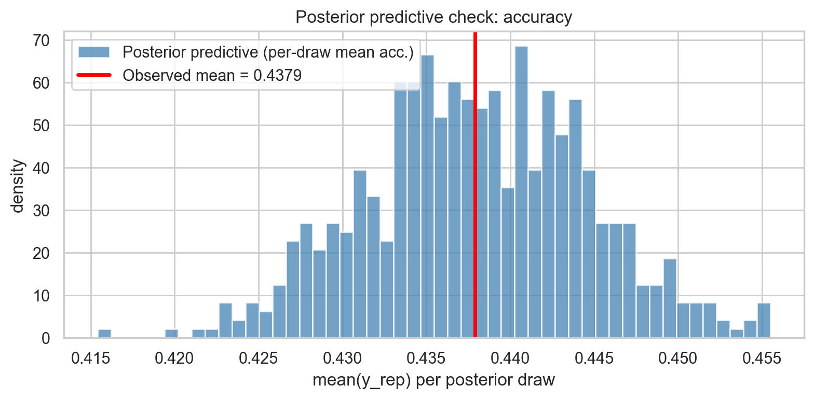
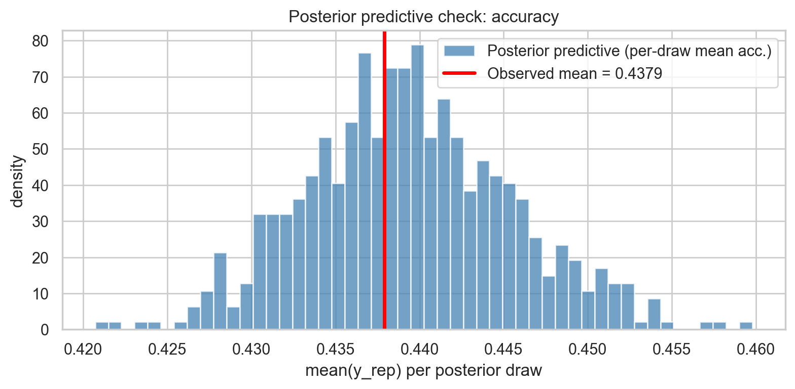
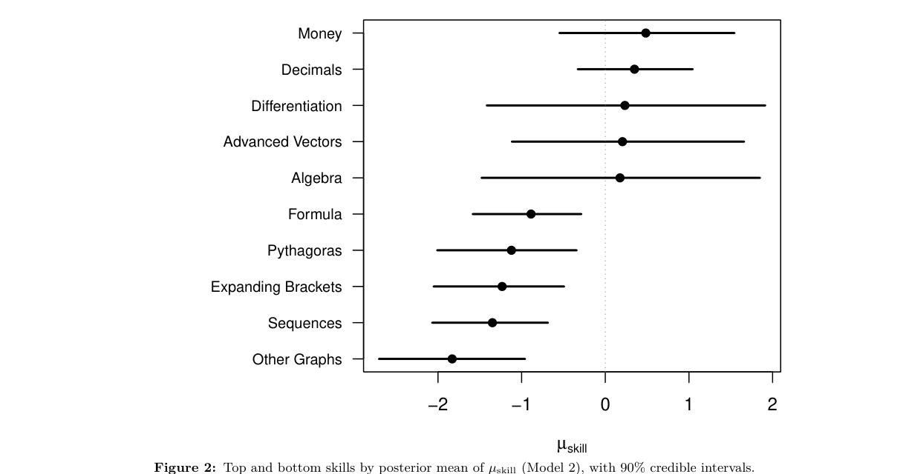
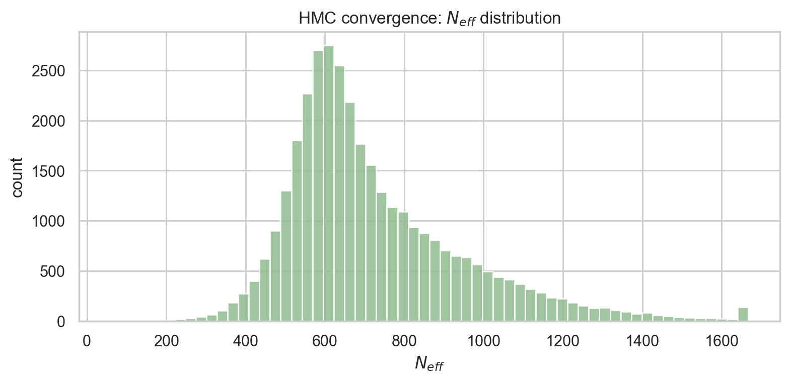
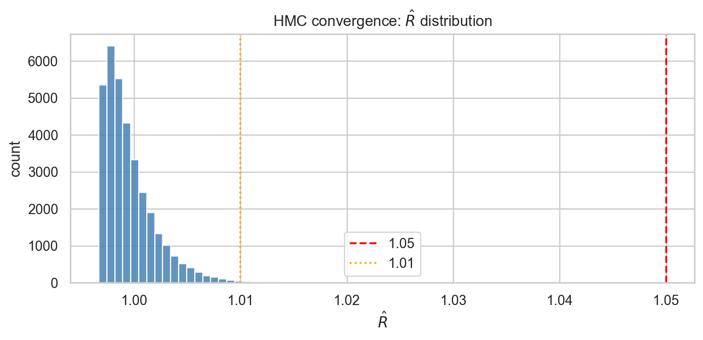
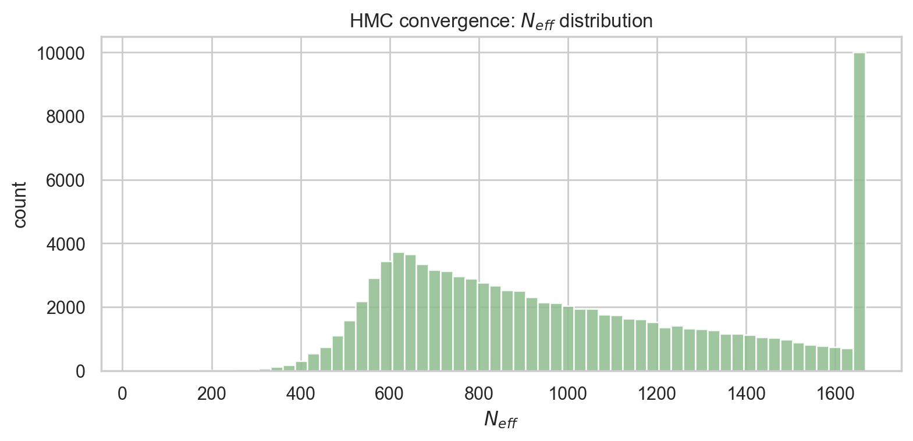
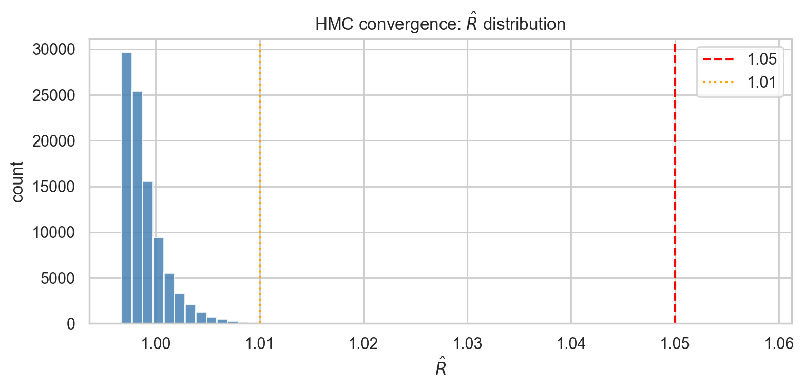
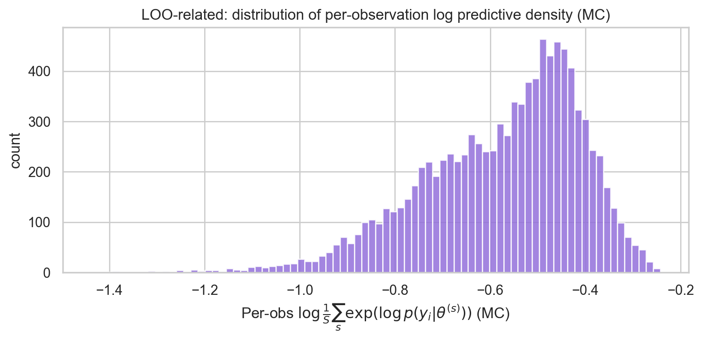
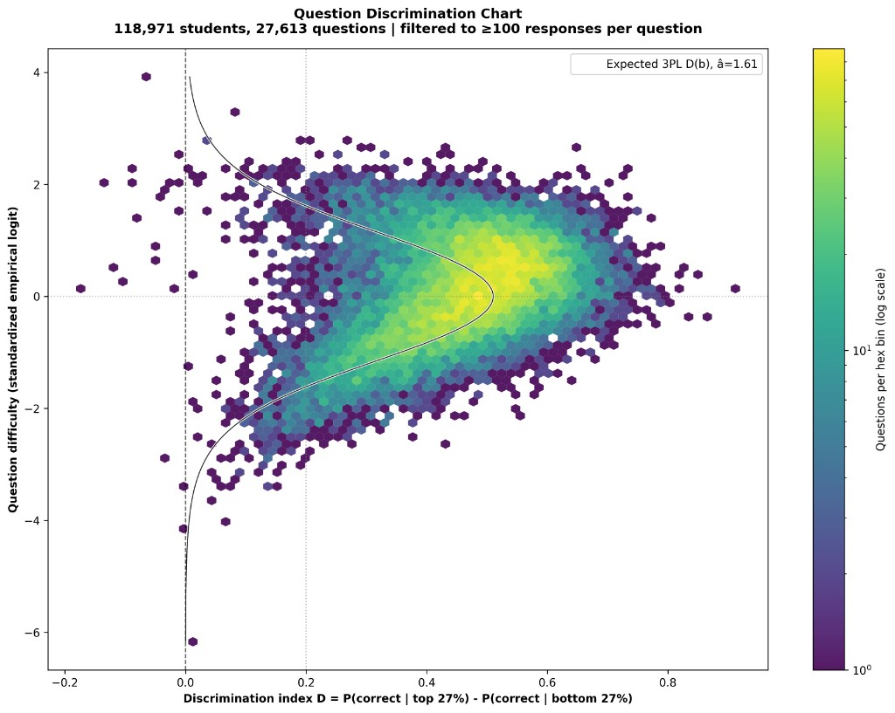

# STAT 405 Final Report
**Bayesian Hierarchical Item Response Theory for Mathematics Education**

**Karn Shoker** (59310094) · **Joseph Lardner-Burke** (44848893)  
April 19, 2026  
[LinkedIn](https://www.linkedin.com/in/kshoker12/)

### Quick Access
- **[GitHub Repository](https://github.com/kshoker12/STAT_405_Project)** — Stan models, data processing, and report artifacts

## 1 Introduction

### 1.1 Background & Motivation

> “It ain’t what you don’t know that gets you into trouble. It’s what you know for sure that just ain’t so” ~ Mark Twain

Mathematical education modelling is a vital task today. This matters for two reasons. We are living in an increasingly technical world where the demands of the workforce are increasingly specialised in stem related subjects; a solid maths background lies at the core of excelling in these areas not only on the individual level but also the governmental societal planning level. Secondly with the rising inequality, in many developing nations as well as developed nations, maths education is a great equaliser as it enables many students to achieve better lives than their parents. Furthermore, in resource-constrained areas with poorly functioning schools, online maths education has the ability to aid teachers in providing a higher standard of learning for students.

An important question is, “Why then are we modelling the mathematics abilities of students rather than simply just giving them more problems? Why is this practice of modeling important?” It is important because for students learning mathematics one of the most important things is knowing what you do not yet know. That is knowing your abilities as this enables targeted practice for students in learning what they do not yet know. For governments and teachers the same interest is there. We perform tests to try to understand where a class is academically and adjust the syllabus accordingly, focusing on weak spots and reclarifying what is necessary. Governments may recognise bias in the education system and seek to correct certain strata of the population in particular geographies performing worse than others. Furthermore governments are able to get feedback on particular interventions to see if they are actually working. Thus measuring students’ abilities enables resource planning on behalf of students, educators and governments.

### 1.2 Scientific Question

The central question of this paper is can we, using a bayesian IRT framework, work out the abilities of students and the difficulty of problems accurately to discriminate between students and predict if a student will answer a question correctly or incorrectly.

## 2 Literature Review

This paper deals with the problem of modelling users’ abilities from multiple choice questions in the subject of mathematics. This fits into a broader class of literature of intense focus called Item Response Theory, IRT, which is at the intersection of the fields of education and psychology.

Traditional modeling techniques, specifically frequentist approaches, which were the only approaches the broad swath of researchers were familiar with in this field, are not well specialized to this problem of IRT because they require the Law of Large Numbers to kick in. When working in small data sets this is often a data collection problem as seen frequently in the educational landscape. Furthermore, frequentist modelling struggles with parameter estimates that are often biased and unstable in small sample sizes (in the case where all answers were answered incorrectly or correctly ability parameters blow up, due to the boundary separation problem). One last very important problem that really struggles with discrimination of students, that is differentiating between stronger and weaker students from a set of difficult questions.

Bayesian modelling became more popular in recent years in light of these glaring issues. This is obvious to a bayesian due to well specified models being calibrated for all data sizes allowed. Furthermore Bayesian models are extremely flexible in that adding layers to Hierarchical models can be simple. Furthermore bayesian modelling is particularly useful in this context due to its implicit focus on uncertainty in parameter estimates. Another shine as demonstrated in (Bainter & Foster, 2019) is that Bayesian estimation is great when some responses are sparsely endorsed (as found in our data set). One final note is that since we are able to simply simulate from a model we can check very easily for bugs in our code.

Specific articles that have begun demonstrating the usefulness of Bayesian modeling in IRT include (Béguin & Glas 2001; Bürkner, 2021, Finch & French 2019, Sheng, 2012, Zhang et al 2021.)

## 3 Dataset

### 3.1 Data

We analyze digital mathematics practice data released for the NeurIPS 2020 Education Challenge. The raw event logs record student–question interactions, including correctness, timestamps, and question- and student-level metadata. After joining question metadata, student metadata, and answer timestamps, the processed training table contains 17,250,577 answer-level observations.

Because full Bayesian inference in Stan is computationally expensive at this scale, we fit our models on a stratified subsample. Specifically, we restrict attention to students with at least 30 answered questions, then sample 500 students at random and retain up to 10,000 total answers for fitting.

### 3.2 Variables

Each observation corresponds to a student’s response to a single question. The primary fields used in modeling are:

- **UserId, QuestionId, AnswerId:** identifiers (keys).
- **IsCorrect:** binary outcome indicator (1 = correct, 0 = incorrect).
- **TimeTaken:** response time in seconds, constructed from answer timestamps (time elapsed between consecutive answers). We use response time both as a continuous outcome (for speed) and to define “fast” responses (e.g., under a fixed threshold after filtering).
- **Age:** approximate age at attempt, derived from date of birth and answer timing.
- **Gender:** categorical covariate from student metadata (including an “unknown/other” category as needed).
- **skill_indices:** a set of skill/topic identifiers associated with each question (see Section 3.3).

### 3.3 Ability taxonomy (skill hierarchy)

Items are tagged with skills from a hierarchical subject tree. We use this taxonomy to define ability parameters at multiple levels of granularity, ranging from coarse strands to fine-grained topics. The hierarchy can be summarized as:

<figure class="table-figure">
<table>
<thead>
<tr><th>Level</th><th># of abilities</th><th>Interpretation / examples</th></tr>
</thead>
<tbody>
<tr><td>0</td><td>2</td><td>Top-level roots (e.g., Mathematics, Science)</td></tr>
<tr><td>1</td><td>9</td><td>Broad strands (e.g., Number, Algebra, Geometry and Measure, Data and Statistics, ...)</td></tr>
<tr><td>2</td><td>69</td><td>Intermediate topics (e.g., Fractions, Decimals, Straight Line Graphs, ...)</td></tr>
<tr><td>3</td><td>308</td><td>Fine-grained tagged topics (e.g., BIDMAS, Expanding Single Brackets, ...)</td></tr>
</tbody>
</table>
<figcaption>Table 1. Skill hierarchy levels used in the NeurIPS 2020 Education Challenge taxonomy.</figcaption>
</figure>

## 4 Bayesian Hierarchical IRT Model

For the naive model we only considered 9 parameters for the student abilities whereas for the complex model we 69 parameters for the student abilities. This comes with a significant difference in computation as well as optimisations in stan. The structure of the data for question skills was a forest of skills. Specifically two trees one with root maths and the other with root science. Skills are organised as a forest of two trees. Each question corresponds to a subtree of this forest, sharing at least one root and one leaf with the global structure.

The two models differ only in which level of this tree they operate on: the 9-skill model uses nodes at depth 2 from the leaves (coarse, near-root), while the 69-skill model uses nodes at depth 1 (fine-grained, near-leaf).

Note: For variational inference we used mean field in stan thus our variational family was \\(Q = \{q_\phi : \phi \in \Phi\}\\).

### 4.1 Likelihood

$$
y \mid \theta, d, \gamma, \alpha \sim \mathrm{Bernoulli}\big(\gamma + (\alpha - \gamma)\,\mathrm{logistic}(\theta - d)\big)
$$

$$
t \mid E, \mu_t, \sigma_t \sim \pi \cdot \mathcal{N}(\mu_t, \sigma_t^2) + (1 - \pi) \cdot \mathcal{N}(3.0, 1.5^2)
$$

\\(E(t) \mid \beta_t = \mathrm{logistic}(\beta_t \cdot t)\\) is the probability of being in the engaged state (as opposed to the guessing state), increasing with response time.

### 4.2 Latent Skill

The effective skill of a player on a question is the average of their latent skills across the skills that question requires.

$$
\theta = \frac{1}{|S|} \sum_{k \in S} u_k
$$

Note if we did not do this we would have questions demanding more skills being more likely to be solved. Additionally if we added weights we might get into identifiability issues so we decided to take an average.

### 4.3 Player Skill Hierarchy

Player skills are drawn from a population whose mean is shifted by player-level covariates:

$$
u_k \mid \mu_k, \sigma_k, z, g \sim \mathcal{N}(\mu_k + \beta_k^{\mathrm{age}}\, z + \beta_k^{\mathrm{gender}}\, g,\; \sigma_k^2)
$$

$$
\mu_k \sim \mathcal{N}(0, 1), \quad \sigma_k \sim \mathrm{Exponential}(1)
$$

$$
\beta_k^{\mathrm{age}}, \beta_k^{\mathrm{gender}} \sim \mathcal{N}(0, 0.5^2)
$$

Here \\(z\\) is a player’s standardised age and \\(g\\) is a binary gender indicator. Note that we had to normalize age to avoid this parameter having a non relative effect.

### 4.4 Question Difficulty

$$
d \sim \mathcal{N}(0, 1)
$$

### 4.5 3PL Asymptotes

The guessing floor \\(\gamma\\) rises for fast responses: \\(\gamma = \gamma_0 + \gamma_\Delta \cdot \mathbf{1}[\mathrm{fast}]\\). The bounds ensure \\(\gamma < \alpha\\) by construction.

$$
\gamma_0 \sim \mathcal{N}(0.25, 0.08^2), \quad \gamma_\Delta \sim \mathcal{N}(0.05, 0.05^2), \quad \alpha \sim \mathcal{N}(0.90, 0.05^2)
$$

\\(\gamma_0\\) is the baseline guessing floor. Ie if someone is immediately guessing then due to their being four options we would say they have a 25% chance of getting it correct. \\(\gamma_\Delta\\) is the small bump added if the response was fast, making it more likely the user guessed.

### 4.6 Response Time Parameters

$$
\mu_t \sim \mathcal{N}(4.5, 1^2), \quad \sigma_t \sim \mathrm{Exponential}(1), \quad \beta_t \sim \mathcal{N}(1, 0.5^2)
$$

After doing some rudimental analysis of histogram plots it was clear that the time parameters followed an exponential distribution and that students were more likily to get the problem correct if they spent more time on the problem.

## 5 Posterior Computation & Inference Methods

### 5.1 What is being approximated?

Let \\(y\\) denote the observed data (correct/incorrect responses, response times, and observed covariates used in the likelihood), and let \\(\theta\\) denote the collection of unknown quantities in the model (global parameters, skill-related parameters, and student-level latent variables). Our inferential target is the Bayesian posterior distribution

$$
p(\theta \mid y) \propto p(y \mid \theta)\, p(\theta),
$$

The likelihood of the observed data under the generative model multiplied by the prior, normalized by the marginal likelihood \\(p(y)\\). Since \\(p(y)\\) is intractable for our hierarchical models, we do not compute the posterior in closed form and instead we approximate \\(p(\theta \mid y)\\) numerically and report posterior summaries (e.g. posterior means/medians, credible intervals) and derived quantities of interest.

### 5.2 Hamiltonian Monte Carlo (NUTS)

Our primary posterior computation uses Hamiltonian Monte Carlo (HMC) with the No-U-Turn Sampler (NUTS) as implemented in Stan. NUTS constructs a Markov chain targeting \\(p(\theta \mid y)\\) using Hamiltonian dynamics to propose distant moves with high acceptance, which typically improves exploration relative to random-walk Metropolis methods in high dimensions. We run 2 independent chains with a warmup/adaptation phase followed by a sampling phase. Posterior summaries are computed from the retained post-warmup draws.

### 5.3 Variational Inference (mean-field)

As a second approach, we use variational inference (VI) in Stan. VI approximates the posterior by a tractable family \\(q_\phi(\theta)\\) and chooses \\(\phi\\) by maximizing the evidence lower bound (ELBO), equivalently minimizing \\(\mathrm{KL}(q_\phi(\theta) \,\|\, p(\theta \mid y))\\). We use mean-field VI, which is computationally efficient but can be biased and may underestimate posterior uncertainty when posterior dependencies are strong. We draw samples from the fitted variational approximation \\(q_\phi\\) to compute VI-based posterior summaries that can be directly compared to HMC.

### 5.4 Two-model × Two-method design

We fit two probabilistic models (Model 1: simple; Model 2: complex) and compute their posteriors using two inference methods (HMC/NUTS and VI). Section 6 evaluates (i) the reliability of the HMC approximation via MCMC diagnostics, (ii) VI approximation quality via direct comparison to HMC, and (iii) goodness-of-fit via posterior predictive checks and predictive scores.

## 6 Critical Evaluation & Diagnostics

### 6.1 Posterior approximation diagnostics (HMC reliability + VI approximation error)

We evaluate posterior approximation quality in two ways. First, we assess whether HMC/NUTS has mixed well enough to provide reliable Monte Carlo estimates using standard Stan diagnostics: \\(\hat{R}\\) (between-chain agreement) and effective sample size \\(N_{\mathrm{eff}}\\) (amount of independent information after accounting for autocorrelation). Second, we assess VI approximation error by directly comparing VI-based posterior summaries to HMC-based summaries for key low-dimensional parameters.

**HMC/NUTS diagnostics.**

<figure class="table-figure">
<table>
<thead>
<tr><th>Model</th><th># quantities</th><th># \\(\hat{R}\\) &gt; 1.05</th><th># \\(\hat{R}\\) &gt; 1.01</th><th>median \\(N_{\mathrm{eff}}\\)</th><th>min \\(N_{\mathrm{eff}}\\)</th></tr>
</thead>
<tbody>
<tr><td>Model 1 (simple)</td><td>34,401</td><td>0</td><td>178</td><td>663.0</td><td>59.98</td></tr>
<tr><td>Model 2 (complex)</td><td>94,641</td><td>1</td><td>243</td><td>912.3</td><td>33.65</td></tr>
</tbody>
</table>
<figcaption>Table 2. HMC/NUTS convergence diagnostics for Model 1 and Model 2.</figcaption>
</figure>

These results indicate broadly acceptable mixing for both models, with slightly weaker convergence for the more complex model, as expected in higher-dimensional hierarchical settings.

**Convergence histograms.**

We provide the full distributions of \\(\hat{R}\\) and \\(N_{\mathrm{eff}}\\) for both models in the Appendix.

**VI approximation error via HMC vs VI.**

We compare VI to HMC on a small set of global parameters using density overlays and a summary table of posterior means and 90% intervals. Mean-field VI exhibits systematic deviations from HMC for several parameters (notably shifts in posterior means and typically smaller posterior standard deviations), with larger discrepancies for Model 2. Therefore, we treat VI as a fast approximation useful for exploration and benchmarking, but we rely on HMC/NUTS for primary uncertainty quantification when diagnostics are acceptable.

<figure class="table-figure">
<table>
<thead>
<tr><th>Parameter</th><th>HMC estimate</th><th>VI estimate</th><th>Difference (VI - HMC)</th></tr>
</thead>
<tbody>
<tr><td>\\(\gamma_0\\) [baseline guessing / lower asymptote]</td><td>0.170</td><td>0.255</td><td>0.085</td></tr>
<tr><td>\\(\alpha\\) [upper asymptote]</td><td>0.809</td><td>0.672</td><td>-0.138</td></tr>
<tr><td>\\(\beta_t\\) [time effect slope]</td><td>0.925</td><td>0.934</td><td>0.009</td></tr>
<tr><td>\\(\mu_{\log t}\\) [mean log response time]</td><td>5.887</td><td>5.928</td><td>0.041</td></tr>
<tr><td>\\(\sigma_{\log t}\\) [SD of log response time]</td><td>0.989</td><td>1.006</td><td>0.017</td></tr>
</tbody>
</table>
<figcaption>Table 3. Comparison of point estimates for selected global parameters (Model 2): HMC vs mean-field VI.</figcaption>
</figure>

### 6.2 Model checks (goodness-of-fit)

We assess goodness-of-fit using posterior predictive checks (PPCs) computed from replicated data \\(y^{\mathrm{rep}}\\) generated under the fitted model. A key summary is mean accuracy: we compare the observed mean accuracy in the sample to the posterior predictive distribution of mean accuracy across draws. Both models reproduce the observed accuracy closely: Model 1 yields a posterior predictive mean accuracy of 0.4380 versus observed 0.4379, and Model 2 yields 0.4393 versus observed 0.4379. This indicates that both models capture the overall accuracy rate in the subsample.

<figure id="fig-ppc-accuracy">
  

    

      
      
Left: Model 1 (simple)

    

    

      
      
Right: Model 2 (complex)

    

  

  <figcaption class="plates-caption">
    Posterior predictive check for mean accuracy (observed vs posterior predictive distribution), shown side-by-side for Model 1 and Model 2.
  </figcaption>
</figure>

### 6.3 Predictive comparison (LOO / held-out scoring)

To compare predictive performance between Model 1 and Model 2, we approximate leave-one-out expected log predictive density (ELPD) using the per-observation log-likelihood draws and the log-mean-exp identity. Higher ELPD indicates better expected out-of-sample predictive accuracy. On this subsample, Model 2 achieves a higher ELPD than Model 1, indicating a modest but consistent improvement in predictive fit.

<figure class="table-figure">
<table>
<thead>
<tr><th>Model</th><th>Total ELPD</th><th>ELPD per obs.</th></tr>
</thead>
<tbody>
<tr><td>Model 2 (complex)</td><td>-5759.083</td><td>-0.576</td></tr>
<tr><td>Model 1 (simple)</td><td>-5856.737</td><td>-0.586</td></tr>
</tbody>
</table>
<figcaption>Table 4. Approximate LOO expected log predictive density (ELPD) comparison. Higher ELPD indicates better expected predictive performance.</figcaption>
</figure>

The estimated difference in total ELPD (Model 2 minus Model 1) is 97.654, corresponding to an average gain of about 0.0098 ELPD per observation in this subsample.

## 7 Conclusion

### 7.1 Key findings

Posterior predictive checks show both models match the overall mean accuracy in the subsample (Section 6.2). By approximate LOO ELPD (Section 6.3), Model 2 (complex) predicts modestly better than Model 1 (simple) on this subset. Mean-field VI is fast but can shift location and understate uncertainty for some globals (Section 6.1), so we rely on HMC/NUTS when diagnostics are acceptable.

### 7.2 Covariates (age and gender)

Covariate effects are skill-specific. Only a few age and gender coefficients have 90% intervals excluding zero in this run: age is negative for Factors, Multiples and Primes, Indices, Powers and Roots, and Basic Arithmetic, and gender is negative for Basic Arithmetic (Appendix A.3). These are descriptive associations (not causal) and may reflect confounding, selection into practice, and demographic measurement error.

### 7.3 Global skill means

The global skill location parameters \\(\mu_{\mathrm{skill}}\\) vary across skills, but are most interpretable relatively (rankings/contrasts) because of centering and hierarchical shrinkage. Figure 2 highlights the top/bottom skills by posterior mean with 90% intervals.

<figure id="fig-skill-means">
  
  <figcaption>
    Top and bottom skills by posterior mean of \\(\mu_{\mathrm{skill}}\\) (Model 2), with 90% credible intervals.
  </figcaption>
</figure>

### 7.4 Limitations and future work

We use weakly informative priors to regularize the hierarchy and encode basic constraints (e.g., plausible lower/upper asymptotes). For example, \\(\mu_{\mathrm{skill}} \sim \mathcal{N}(0, 1)\\), \\(\sigma_{\mathrm{skill}} \sim \mathrm{Exponential}(1)\\), and covariate effects use regularizing normals such as \\(\beta_{\mathrm{age}}, \beta_{\mathrm{gender}} \sim \mathcal{N}(0, 0.5)\\), with constraints like \\(\gamma < \alpha\\) enforced by construction.

We did not refit under alternative priors, so conclusions are conditional on these choices. Future work includes targeted prior sensitivity checks, richer PPCs (e.g., response-time and accuracy-by-skill), structured VI, and PSIS-LOO diagnostics (Pareto-k) when available.

### 7.5 Contributions

This project was executed collaboratively. We trained the models using a Kaggle notebook environment and consolidated outputs into this report. Karn Shoker (59310094) led model training, diagnostics, and report writing. Joseph Lardner-Burke (44848893) led model development and contributed to report writing.

## Appendix

### A.1 Convergence diagnostics distributions

<figure id="fig-convergence">
  

    

      
      
Model 1 — \\(N_{\mathrm{eff}}\\)

    

    

      
      
Model 1 — \\(\hat{R}\\)

    

    

      
      
Model 2 — \\(N_{\mathrm{eff}}\\)

    

    

      
      
Model 2 — \\(\hat{R}\\)

    

  

  <figcaption class="plates-caption">
    Convergence diagnostics histograms. Each row is a model (Model 1 then Model 2); within each row, \\(N_{\mathrm{eff}}\\) (left) and \\(\hat{R}\\) (right) are shown side-by-side.
  </figcaption>
</figure>

### A.2 LOO per-observation contributions

<figure id="fig-loo">
  
  <figcaption>
    Histogram of per-observation log predictive density contributions under approximate LOO (Model 2).
  </figcaption>
</figure>

### A.3 Skill-specific demographic effects flagged by 90% intervals

<figure class="table-figure">
<table>
<thead>
<tr><th>Covariate</th><th>Skill_index</th><th>Skill</th><th>Mean</th></tr>
</thead>
<tbody>
<tr><td>Age</td><td>5</td><td>Factors, Multiples and Primes</td><td>-0.401</td></tr>
<tr><td>Age</td><td>8</td><td>Indices, Powers and Roots</td><td>-0.601</td></tr>
<tr><td>Age</td><td>44</td><td>Basic Arithmetic</td><td>-0.449</td></tr>
<tr><td>Gender</td><td>44</td><td>Basic Arithmetic</td><td>-0.668</td></tr>
</tbody>
</table>
<figcaption>Table 5. Skill-specific demographic effects where the 90% credible interval excludes 0 (auto-flagged in report_conclusions.txt). Means are reported on the model’s covariate coefficient scale.</figcaption>
</figure>

### A.4 AI disclosure

We used AI-assisted tools to support formatting, writing flow, and code generation for data processing/analysis pipelines (e.g., restructuring sections, tightening phrasing, drafting helper scripts, and resolving LaTeX/RMarkdown rendering issues). All modeling decisions, analysis outputs, and final claims were reviewed and edited by the authors.

### A.5 Reproducibility and repository

Code and artifacts used to generate this report are available at [https://github.com/kshoker12/STAT_405_Project](https://github.com/kshoker12/STAT_405_Project).

### A.6 Question discrimination (exploratory)

<figure id="fig-discrimination">
  
  <figcaption>
    Question discrimination vs difficulty (exploratory). Each hexbin aggregates questions; the x-axis is an empirical discrimination index and the y-axis is standardized difficulty. The curve overlays an expected 3PL relationship.
  </figcaption>
</figure>

## References

- Bainter, S. A., & Foster, J. S. (2019). *A brief introduction to Bayesian item response theory models.* (Course-referenced background on Bayesian IRT).
- Béguin, A. A., & Glas, C. A. W. (2001). MCMC estimation and some model-fit analysis of multidimensional IRT models. *Psychometrika*.
- Bürkner, P.-C. (2021). Bayesian item response modeling in R with brms and Stan. *Journal of Statistical Software*.
- Finch, W. H., & French, B. F. (2019). *Bayesian estimation of item response theory models.* (Applied Bayesian IRT reference).
- Sheng, Y. (2012). A Bayesian approach to diagnostic classification models. (Bayesian latent-variable modeling reference).
- Zhang, et al. (2021). *Bayesian methods for IRT / educational measurement.* (Bayesian IRT reference).
